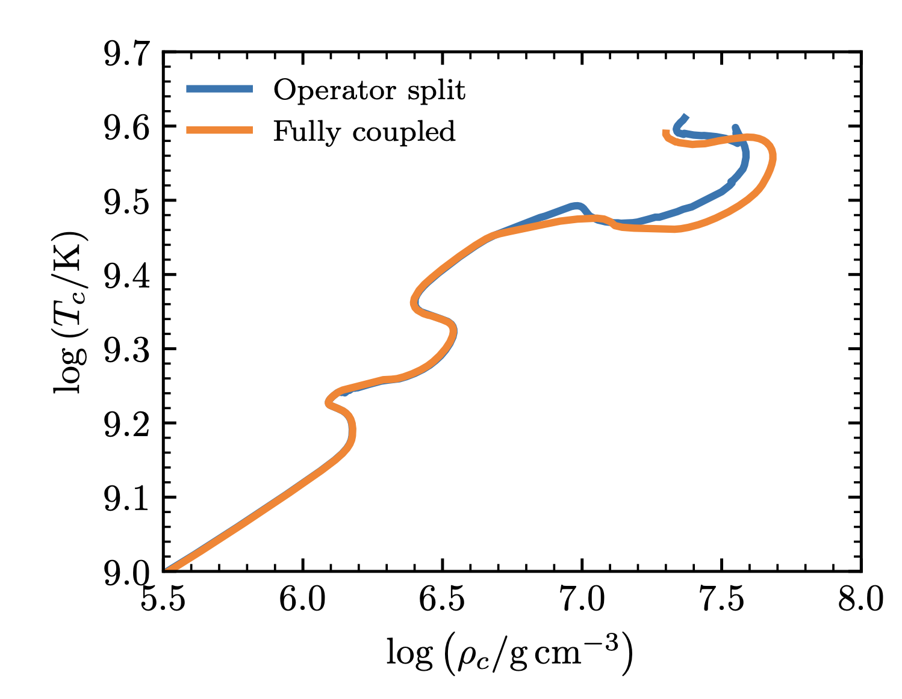

<script type="text/x-mathjax-config">MathJax.Hub.Config({tex2jax:{inlineMath:[['\$','\$'],['\\(','\\)']],processEscapes:true},CommonHTML: {matchFontHeight:false}});</script>
<script type="text/javascript" async src="https://cdnjs.cloudflare.com/ajax/libs/mathjax/2.7.1/MathJax.js?config=TeX-MML-AM_CHTML"></script>

# 3. Evolving to Core-collapse (BONUS)

This lab will continue using the downloaded `changing_rates` directory from the previous lab, where we evolved our stellar model until the end of core-Helium burning. Let's copy over the directory with a new name or redownload it from here: [Changing_rates](https://drive.google.com/file/d/19_R2QITiDjMbPmCc-rnObhKKcITtbohT/view?usp=sharing).

```shell-session
$ cp -r changing_rates evolving_to_cc
```
<!--In `inlist_project` and make sure you are running in single star mode: `evolve_both_stars = .false.`.-->

### Science goal

The goal of this lab is to evolve our stellar model from Helium depletion to core-collapse, and then to anylize the differences in stellar model behavior across varying phases of evolution with respect to the chosen $^{12}$C$(\alpha,\gamma)^{16}$O rate adopted.


|:clipboard: TASK|
|:--|
|change the stopping condition in the `&controls` such that the stellar model evolves until the Fe core is infalling at 100 km/s. See [MESA &controls documentation: When to stop](https://docs.mesastar.org/en/release-r25.012.1/reference/controls.html#when-to-stop).|
|Run the model|


|:information_source: HINT|
|:--|
|If the stellar model struggles during late burning and stalls, consider operator splitting the nuclear reaction network to improve the numerical stability of the stellar model `op_split_burn = .true.`|
|Keep in mind, this will change the results!|
Figure from [MESA VI](https://ui.adsabs.harvard.edu/abs/2023ApJS..265...15J/abstract)



<details>
<summary>Answers: An example pgstar produced from the $\sigma_{^{12}C} = 0$ stellar model evolving to core-collapse</summary>
   
<video width="640" height="480" controls>
  <source src="Figures/Evoution_to_cc.mp4" type="video/mp4">
  Your browser does not support the video tag.
</video>

</details>


