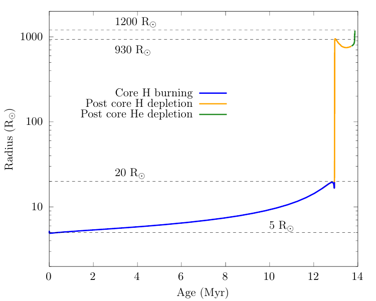

<script type="text/x-mathjax-config">MathJax.Hub.Config({tex2jax:{inlineMath:[['\$','\$'],['\\(','\\)']],processEscapes:true},CommonHTML: {matchFontHeight:false}});</script>
<script type="text/javascript" async src="https://cdnjs.cloudflare.com/ajax/libs/mathjax/2.7.1/MathJax.js?config=TeX-MML-AM_CHTML"></script>

In this section, you will continue with the `Lab1_binary` directory from the introduction. You can also re-download a copy of the desired [Lab1_binary](https://drive.google.com/file/d/1p7A4C0r1Be3CPxPLLIVNXZTVtVWccvze/view?usp=share_link) MESA work directory, but make sure `pgbinary_flag` is set to true in `inlist_project` as we did in the introduction.


# Lab1 - Modeling a star through envelope stripping


## Science goal

In this lab, we will look at how stars stripped by binary interactions evolve compared to their single star counterparts. We will look at how the appearance (e.g. luminosity, temperature), structure (e.g. core mass) of the *donor star* changes depending on the binary orbital parameters and mass transfer efficiency. These properties are very important when we compare stellar models to observed pre-supernova progenitors.

### Bonus goal

If you'd like to prepare for Lab3, you can start running a simulation with both stars and leave it running over lunch.


## The evolution of the primary star

Assume that we have a binary star system where the components are close enough to undergo Roche Lobe overflow (RLOF) from the inner L1 Lagrangian point. Additionally, assume that both components do not have the same mass so that the evolution of one star slightly lags the other star. In the lab, we would like to explore how the primary - more massive - star evolves in such a binary.

Since here we are primarily interested in the evolution of the primary, to save some computation time we are going to approximate the secondary as a point mass. In other words, we are not going to model the evolution of the secondary. Then, later in Lab3, we will switch to treating the primary as a point mass and focus on evolving the secondary mass gainer (accretor).


Let's begin by using the downloaded `Lab1_binary` directory from the introduction. We will begin by modeling this system as a star + point mass. To do this, open `inlist_project` and make sure to set `evolve_both_stars = .false.`.

In the `&binary_controls`, you should see the following lines:

```
   m1 = 15d0  ! donor mass in Msun
   m2 = 12d0 ! companion mass in Msun
   initial_period_in_days = 6d0
```

A range of parameters to adjust the mass transfer efficiency are also available in `inlist_project`. Below is an example of a fully conservative mass transfer scheme where all the mass lost by the primary is assumed to be accreted onto the secondary ($\dot{M}_2=-\dot{M}_1$).

```
   ! Mass transfer efficiency controls
   mass_transfer_alpha = 0d0      ! fraction of mass lost from the vicinity of donor as fast wind
   mass_transfer_beta = 0d0     ! fraction of mass lost from the vicinity of accretor as fast wind
   mass_transfer_delta = 0d0    ! fraction of mass lost from circumbinary coplanar toroid
   mass_transfer_gamma = 0d0    ! radius of the circumbinary coplanar toroid is ``gamma**2 * orbital_separation``
```

For non-conservative mass transfer, part of the mass that is transferred to the accretor escapes the system ($\dot{M}_2=-(1-\alpha-\beta-\delta)\dot{M}_1$). The lost mass can take away some angular momentum from the binary, and the amount of angular momentum it takes away depends on the details of the mass transfer flow. Each of the mass transfer parameters corresponds to a different angular momentum loss mode, as described in the comments. Here, we will assume that the non-accreted mass takes away the specific angular momentum of the accretor (Jeans mode mass loss). For example, if half of the transferred mass is lost from the system, we set the parameters like this

```
   mass_transfer_beta = 0.5d0     ! fraction of mass lost from the vicinity of accretor as fast wind
```

Now, let's explore the different types of mass transfer and the impact of nonconservative mass transfer on the evolution of our binary system.

For this lab we will keep the primary and companion/accretor mass fixed at **`m1 = 15d0`** and **`m2 = 12d0`**, do not adjust these masses. We will explore the effect of different masses and mass ratios later on in Lab2. In this lab we will explore the binary evolution of our system with varying periods by modifying `initial_period_in_days`, and the impact of adopting nonconservative mass transfer by adopting a different value for $\beta$. Each person at your table will run one of the following four models shown in the table below, and you will compare and discuss your results with one another.

| Case |Donor Mass ($M_{\odot}$) | Accretor Mass (M$_\odot$)|Period (days)| $\beta$ |
|:--|:---|:---|:----|:----|
| 1 | 15 | 12 | 4   | 0   |
| 2 | 15 | 12 | 15  | 0   |
| 3 | 15 | 12 | 200 | 0   |
| 4 | 15 | 12 | 15  | 0.5 |

|:clipboard: TASK|
|:--|
|Now choose a value for the initial period and $\beta$ of the binary system from this table. |

<!-- 
Since this lab is focused on envelope stripping and mass transfer physics,  we'd like to save some computation and terminate our models before the mass transfer phase ends. Evolving trhough the mass transfer phase for the default case happens around model number 370 (and takes 11 mins). We'll try to reduce this computation time by terminating our model once it loses 50% of its mass.

Let's add a stopping condition to our model such that it terminates when the Primary loses 50% of its initial mass.
-->

For solar metallicity stars, it is known that mass transfer processes will strip most of the hydrogen envelope over relatively short timescales. However, the computational cost ramps up as the remaining envelope mass decreases, so we could end up spending most of our computation time trying to strip off the last bit of envelope, even though it may not be long in physical time. In the first half of this lab, we will focus on examining the stability and timescale of mass transfer, so let's apply a stopping condition to terminate the calculation before the computation slows down.

|:clipboard: TASK|
|:--|
|Try to apply a stopping condition so that the calculation finishes when 80% of the donor's envelope is lost. See [MESA &controls documentation: When to stop](https://docs.mesastar.org/en/release-r24.03.1/reference/controls.html#when-to-stop).|


|:information_source: HINT|
|:--|
|This can be done by setting a stopping condition in `inlist1`.|
|Don’t forget to uncomment the mass transfer parameters by deleting the `!` in front of them.|

<details markdown="block">
<summary>Answers: Example code</summary>

Add this to `&controls` in `inlist1`

```
   envelope_fraction_left_limit = 0.2
```

</details>


Now, let's run the model. We need to execute the below commands in the terminal to compile our `run_binary_extras.f90` file and run the calculation.

```shell-session
$ ./mk
$ ./rn
```

The model should take roughly 4 minutes to run on a 4 core machine, you can use this time to inspect and discuss differences between your models and those of the others at your table. 

When your model has finished running, try to make a movie of your `&pgbinary` diagram so you can watch the movie instead of re-running your MESA model. In your `Lab1_binary` directory you can execute the `images_to_movie` command to convert your saved `&pgbinary` pngs into a movie. Here is an example that produces a .mp4 movie named `movie.mp4`.

```shell-session
$ images_to_movie "png/*.png" movie.mp4
```

|:information_source: INFO |
|:--|
|If the command doesn't work, make sure to update your MESA SDK. |

<details>
<summary>Answers: An example pgbinary produced from the case 1 in the table above</summary>
   
<video width="640" height="480" controls>
  <source src="Figures/case_1.mp4" type="video/mp4">
  Your browser does not support the video tag.
</video>

</details>

Now that you have created a wonderful `&pgbinary` movie, let's use this movie in conjuction with our terminal output from our run to answer the following questions!

|:information_source: CATCH UP|
|:--|
| If you are having issues generating a pgbinary movie, we have provided precomputed `&pgbinary` movies for all the runs [available for download here](https://drive.google.com/drive/folders/141zIE0F86UDTk3ZmR5aKN6GkDOnoGuP1?usp=share_link).|

Below are some questions to discuss at your table and answer while your model evolves

| :question: QUESTIONS | 
| :--- |
| 1. What type of mass transfer does your system undergo? Case A, B, C? |
| 2. Is the mass transfer in your system stable or unstable?|
| 3. What is the mass transfer timescale (e.g. $\tau_\mathrm{mt}\equiv \|M_1/\dot{M}_1\|$)?|


### What are the different types of mass transfer?


Mass transfer in binary systems are often classified based on which burning stage the donor star is in. This is because stars have very different structures depending on the burning stage and therefore respond to mass loss in completely different ways.

<dl>
  <dt> Case A mass transfer </dt>
       <dd> Mass transfer from a core hydrogen burning star (main sequence star).</dd>
  <dt> Case B mass transfer </dt>
       <dd> Mass transfer from a core hydrogen depleted star (post-main sequence star).  </dd>
  <dt> Case C mass transfer </dt>
       <dd> Mass transfer from a core helium depleted star. </dd>
</dl>

We sometimes combine the different types if multiple mass transfer phases occur in the same system. For example, if Case A mass transfer is followed by Case B mass transfer, we call it Case AB mass transfer.

How do we know which type of mass transfer occurs? This can be done by simply comparing the size of the star during various burning stages to the size of its  Roche lobe.


The Roche lobe size can be estimated with the following formula

$$
\frac{R_\mathrm{rl}}{a} = \frac{0.49q^{2/3}}{0.6q^{2/3}+\ln{(1+q^{1/3})}}\equiv f(q)
$$

Here, $R_\mathrm{rl}$ is the volume equivalent Roche lobe radius of the donor, $a$ is the orbital semimajor axis and $q\equiv M_\mathrm{d}/M_\mathrm{a}$ is the mass ratio of the donor to accretor. Mass transfer occurs when the stellar radius exceeds the Roche lobe radius $R_\mathrm{d}>R_\mathrm{rl}$.

|:question: QUESTION |
|:--|
|Calculate the orbital period ranges for Case A/B/C mass transfer for a 15+12$M_\odot$ binary. |

The radius evolution of our 15$M_\odot$ star looks like this:


*<br>Radius evolution of a 15 M$_\odot$ star*

Different colours indicate which burning stage the star is in. The dashed lines mark the radii of the star at ZAMS and the maximum extent during each burning stage.

<details><summary>Answers</summary>

If the donor star engages in mass transfer at a given radius $R$, the orbital separation needs to be $a=R/f(q)$. The orbital period of a binary is given by Kepler's law
$$
P_\mathrm{orb}=2\pi\sqrt{\frac{a^3}{G(M_1+M_2)}}.
$$

<dl>
 <dd>Case A: $1~\mathrm{d}\lesssim P_\mathrm{orb}\lesssim7.9~\mathrm{d}$</dd>
 <dd>Case B: $7.9~\mathrm{d}\lesssim P_\mathrm{orb}\lesssim2517~\mathrm{d}$</dd>
 <dd>Case C: $2517~\mathrm{d}\lesssim P_\mathrm{orb}\lesssim3689~\mathrm{d}$</dd>
</dl>

Discussion point: What are the ratios of Case A vs Case B vs Case C mass transfer if we assume a log-uniform orbital period distribution?

</details>

## Bonus 1: Evolving through the whole mass transfer phase 

Now that we know all of our models were either case A or case B mass transfer, let's extend the our stopping condition further until core-Carbon depletion. This will allow us to determine whether our models undergo a second mass transfer phase, and whether or not they end their lives a Blue, Yellow, or Red Supergiant (BSG,YSG,RSG).


First, remove the stopping condition we applied earlier. Then in `run_star_extras.f90`, let's add a new stopping condition so that our model terminates when the primary reaches core Carbon depletion. Let's terminate the model when $X(^{12}\mathrm{C})\leq10^{-4}$:

Note that just adding a control like the following will not work for all cases. But why?
```plaintext
      xa_central_lower_limit_species(1) = 'c12'
      xa_central_lower_limit(1) = 1d-4
```
This is because most of the initial $^{12}\textrm{C}$ present at ZAMS is converted into $^{14}\textrm{N}$ via the CNO cycle during core-Hydrogen burning. The $^{12}\textrm{C}$ present in the core at the onset of Carbon burning is produced via the $3\alpha$ and $^{12}\mathrm{C}(\alpha,\gamma)^{16}\mathrm{O}$ reactions during core-Helium burning. To prevent our models from prematurely terminating, we need to add a custom stopping condition in our `run_star_extras.f90`.

|:clipboard: TASK|
|:--|
| Add a custom stopping condition that will terminate your model when the central mass fractions $X(^{12}\mathrm{C})\leq10^{-4}$ and $X(^{4}\mathrm{He})\leq10^{-4}$ are both true.|


|:information_source: Tips|
|:--|
|Specifically, you're looking to modify the `extras_finish_step` function in `run_star_extras.f90`.|


<details markdown="block">
<summary>Answers: Example c12 stopping condition</summary>

```fortran
integer function extras_finish_step(id)
   use chem_def , only: ihe4, ic12
   integer, intent(in) :: id
   integer :: ierr
   type (star_info), pointer :: s
   ierr = 0
   call star_ptr(id, s, ierr)
   if (ierr /= 0) return
   extras_finish_step = keep_going

   if (s% xa(s% net_iso(ic12),s% nz) < 1d-4 .and. s% xa(s% net_iso(ihe4),s% nz) < 1d-4) then
      extras_finish_step = terminate
      write(*,*) 'Reached Core Carbon depletion, Model finished evolution.'
   end if

end function extras_finish_step
```


</details>

When you're finished modifying the `run_star_extras.f90` file, be sure to check that your code compiles by running the following and terminating your model after a few timesteps.

```shell-session
$ ./clean
$ ./mk
```


Now that we've added our new stopping condition, you can save yourself some computation time by restarting your binary mass transfer model from the photo created at the end of your previous run.
This can be done by executing the following example command in the terminal for a model that terminated at timestep 353.

```shell-session
$ ./re x000353
```


Again, you can make `&pgbinary` movie of your run and use it with your terminal output to answer the following questions!

|:information_source: CATCH UP|
|:--|
| If you are having issues generating a pgbinary movie, we have provided precomputed `&pgbinary` movies for all the runs [available for download here](https://drive.google.com/drive/folders/15ZZN-SQOiDLfuvV1eugfkNQqfUy6Stmw?usp=share_link).|

<details>
<summary>Answers: An example pgbinary produced from the case 1 in the table above</summary>

<video width="640" height="480" controls>
  <source src="Figures/case_1_bonus1.mp4" type="video/mp4">
  Your browser does not support the video tag.
</video>

</details>

| :question: QUESTIONS | 
| :--- |
| 1. How much of the envelope has the donor lost? |
| 2. Is the appearance of the donor (luminosity and temperature) different from what you would expect for a normal core He depleted star?|
| 3. Is there another mass transfer phase following the first one (Case AB/BB)?|
| 4. What do your supernova progenitor look like, is it a Blue, Yellow, or Red Supergiant?|
| 5. What kind of observational supernova would the primary star explode as?|

Here are some rough characteristic effective temperatures for massive stars (adopted from [Drout et al. 2009](https://ui.adsabs.harvard.edu/abs/2009ApJ...703..441D/abstract)):

Blue Supergiant (BSG): > 7,500 K

Yellow Supergiant (YSG): 4,800 K – 7,500 K

Red Supergiant (RSG): < 4,800 K


## Bonus 2: Evolving both stars

In Lab3, we will be exploring how the accretor star can evolve differently from single stars of the same mass. For this, we need to run the evolution with both stars without assuming the secondary star is a point source. This typically takes much more time than the point source case, so let's keep a model running before you leave for lunch.

We'd like to save the final `accretor_final.mod` file from the accretor (secondary) for use in Lab3, so let's remove all the stopping conditions we applied earlier. Then in `inlist1`, set a stopping condition such that the model terminates when the primary reaches core helium depletion. Let's terminate the model when $X(^4\mathrm{He})\leq10^{-4}$:

We can do this by adding the following stopping condition in `inlist1`
```plaintext
      xa_central_lower_limit_species(1) = 'he4'
      xa_central_lower_limit(1) = 1d-4
```

Run the same model as you did in Lab1 but now with

```
   evolve_both_stars = .true.
```

|:information_source: CATCH UP|
|:--|
| If you are having issues generating a pgbinary movie, we have provided precomputed `&pgbinary` movies for all the runs [available for download here](https://drive.google.com/drive/folders/1y-zGeKdwQ3mJL0QT-mJLx2IFLSAW1fXi?usp=share_link).|

You will now see both stars being evolved in the `&pgbinary` plots that looks like this.

<!--- 
*<br> Example of pgbinary with `evolve_both_stars=.true.`*
--->
<video width="640" height="480" controls>
  <source src="Figures/case_1_bonus2.mp4" type="video/mp4">
  Your browser does not support the video tag.
</video>

Remember you'll be using your `accretor_final.mod` from this bonus in Lab3, but don't worry if you don't get this far as we will provide a copy of `accretor_final.mod` for you if you run out of time before generating one yourself.

|:information_source: CATCH UP|
|:--|
| If you are having issues generating the `accretor_final.mod` file for Lab3, we have provided precomputed mod files [available for download here](https://drive.google.com/drive/folders/1xK_zLYE7tF5S1QCADcIDLvrmOUqZTCvU?usp=share_link).|

<details>
<summary>There's something we need to tell you...</summary>

You may notice that during the calculation, the secondary star can greatly exceed its own Roche lobe size. This is because we have relaxed the stopping condition so that the calculation won't stop even though the binary has become an overcontact binary. In reality, the overcontact binary could lose mass through the second Lagrangian point or through winds, or simply merge into a single object. Given that we don't really know what should happen in nature, we will simply focus on how the accretor star evolves within this framework in Lab3. 

</details>
