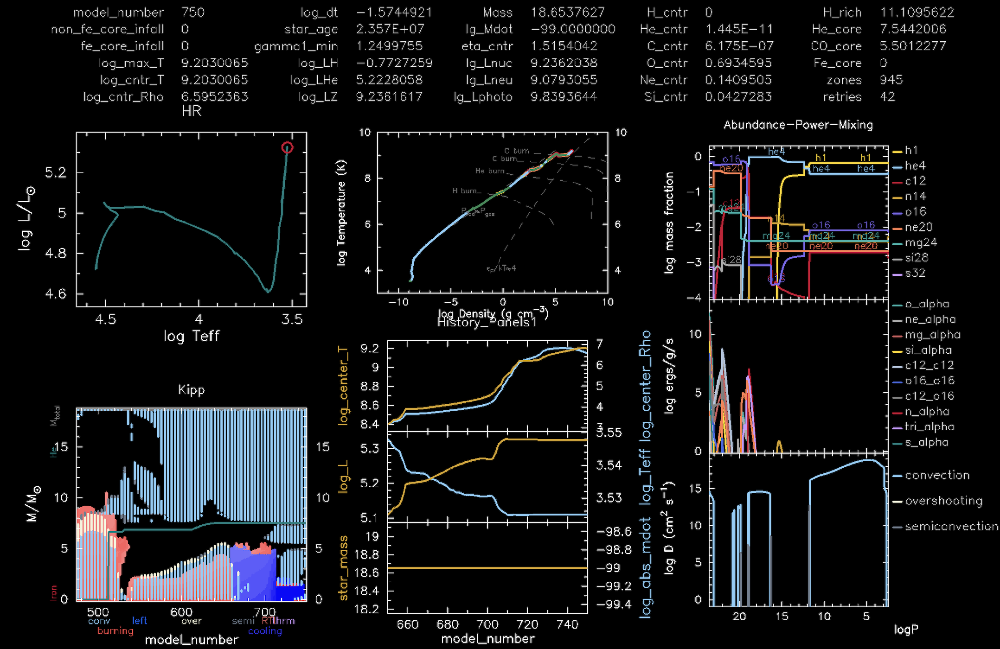
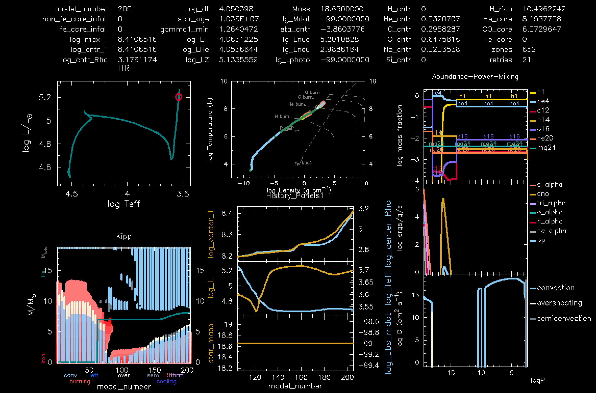
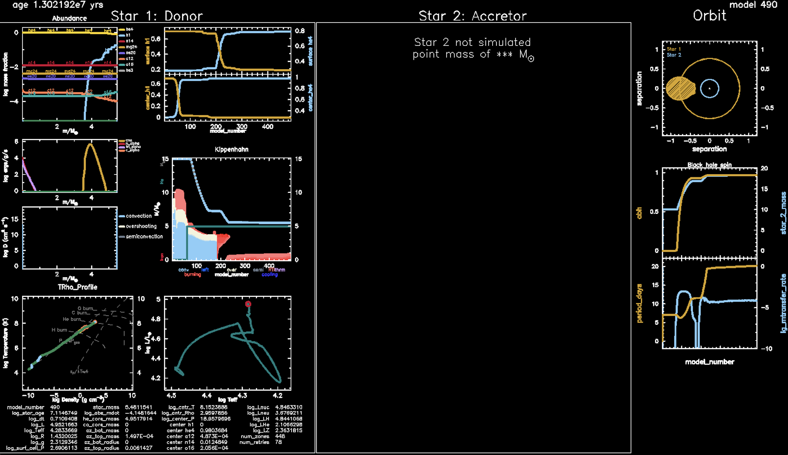

<script type="text/x-mathjax-config">MathJax.Hub.Config({tex2jax:{inlineMath:[['\$','\$'],['\\(','\\)']],processEscapes:true},CommonHTML: {matchFontHeight:false}});</script>
<script type="text/javascript" async src="https://cdnjs.cloudflare.com/ajax/libs/mathjax/2.7.1/MathJax.js?config=TeX-MML-AM_CHTML"></script>


# Lab3 -  Modeling The Mass Gainer

## Science goal

In Lab1 and Lab2, we explored the evolution of a stellar binary, with a particular focus on the mass donor (a.k.a the primary - initially more massive star). In this lab, we now turn our attention towards the other component in the binary, i.e., the mass gainer (a.k.a. the secondary - initially less massive star). The aim is to explore how binary interaction changes the appearance, structure (both surface and internal), and future evolution of the mass gainer. This accreted mass should also carry a substantial amount of angular momentum, which could also impact the star's properties (see, e.g., Renzo and Götberg, 2021 for more information). In this lab, we will ignore the impact of the angular momentum carried by the accreted material on the mass gainer.


### Bonus goal

As a bonus exercise, you may also like to study the evolution of the binary once the primary turns into a compact object, which we assume to be a black hole. In such a case, the secondary could subsequently expand and transfer its matter onto the black hole. This influences the properties of the black hole, like its mass and spin. 
In the bonus exercise, we will explore how the mass and spin of the black hole evolve as a function of the mass accretion rate.


## Evolving the mass gainer as a single star

|:clipboard: TASK|
|:--|
|Let us first evolve the mass gainer as a single star.|

For computational ease, we will load the _saved accretor model_ (`accretor_final.mod`)from the Bonus 2 portion of Lab1 and then evolve this model _as a single star_ (as opposed to Lab1 and Lab2, where we studied binary systems). 

To begin, first copy the necessary files required for Lab3 from the following link 

<a href="https://drive.google.com/drive/folders/1-ypOXDdakm_PsCxDUS6niXmAFkWx2zEm?usp=drive_link" target="_blank">Click here to access Lab3</a>


You will have to download and extract the contents of the `evolve_accretor_star.zip` directory. We recommend that you store them in a parent directory called Lab3. Now go to the directory of Lab1, and from there, copy the file named `accretor_final.mod` into the `Lab3/evolve_accretor_star` directory. This file contains the accretor's information from the previous run and will act as _an initial condition for the present run_. If your Lab1 and Lab3 are in the same base directory, then you could run the following command from the base directory in the terminal to perform the copy operation

```shell-session
$ cp -r ./Lab1_binary/accretor_final.mod ./Lab3/evolve_accretor_star
```

If you did not complete Bonus 2 exercise from Lab1, you can download an `accretor_final.mod` for your case <a href="https://drive.google.com/drive/folders/1xK_zLYE7tF5S1QCADcIDLvrmOUqZTCvU?usp=share_link" target="_blank"> here</a>. Alternatively, if you like, we have also provided a pre-evolved copy of the accretor model in the `evolve_accretor_star` directory with the name `accretor_final_1.mod`. If you want to use this model, rename the file to `accretor_final.mod` to match the name included within `inlist_accretor`.

 
| :question: QUESTION | 
| :--- |
| Can you tell where in `inlist_accretor` is the pre-evolved accretor model being loaded? |


###  Single star versus binary star directory

Before we proceed further, it would be worthwhile to explore the primary differences between the contents of the Lab1 directory and this lab. In Lab1, we evolved both stars. As such, we had two `inlists` (one each for the primary and the secondary star). These inlists contained the parameters that were relevant for each star. In addition, there was an inlist called `inlist_project`, which contained the binary parameters, e.g., the period of the binary and the initial mass of each star in the binary, etc.  Meanwhile, the files contained in the Lab3 directory are shown below.

```
├── LOGS
├── README.rst
├── accretor_final_1.mod
├── ck
├── clean
├── docs
├── history_columns.list
├── inlist
├── inlist_accretor
├── inlist_accretor_header
├── inlist_pgstar
├── make
│   └── makefile
├── mk
├── movie_accretor_star.mp4
├── photos
├── png
├── profile_columns.list
├── re
├── rn
├── rn1
├── src
│   ├── run.f90
│   └── run_star_extras.f90
└── testhub.yml
```

As mentioned in Lab1, to see the above files in your terminal, you need to run the `tree` command. You will notice that here, we only have one main inlist named `inlist_accretor`, which contains the parameters we need to set for evolving the accretor star. Although we would stress that this is not necessary, and you are free to break this one inlist into many sub-inlists. As an example, see the files located in the directory `$MESA_DIR/star/test_suite/ccsn_IIp`. Additionally, you will see that the `src` directory for the accretor star (i.e., evolved as a single star) no longer contains the `run_binary_extras.f90` file - as we are not evolving a binary model anymore.


### Evolution of the mass gainer

Now, let us continue the evolution of the accretor star from where we left it in Lab1. For this, you will need to execute the below commands in your terminal, given that you are already present in the `evolve_accretor_star` directory

```shell-session
$ ./mk 
$ ./rn
```

If all went as planned, you should see a terminal window similar to the one shown below.

```
All this and more are saved in the LOGS directory during the run.
load saved model accretor_final.mod

                             set_initial_number_retries           0
 net name basic.net
                            set_cumulative_energy_error    0.0000000000000000D+00
 kap_option gs98
 kap_CO_option gs98_co
 kap_lowT_option lowT_fa05_gs98
                                        OMP_NUM_THREADS           4

__________________________________________________________________________________________________________________________________________________

       step    lg_Tmax     Teff     lg_LH      lg_Lnuc     Mass       H_rich     H_cntr     N_cntr     Y_surf   eta_cntr   zones  retry
  lg_dt_yrs    lg_Tcntr    lg_R     lg_L3a     lg_Lneu     lg_Mdot    He_core    He_cntr    O_cntr     Z_surf   gam_cntr   iters  
    age_yrs    lg_Dcntr    lg_L     lg_LZ      lg_Lphoto   lg_Dsurf   CO_core    C_cntr     Ne_cntr    Z_cntr   v_div_cs       dt_limit
__________________________________________________________________________________________________________________________________________________

        375   7.570465  4.120E+04   4.941200   4.941200  21.920617  21.920617   0.449337   0.011206   0.863119  -6.466892    477      0
 3.5926E+00   7.570465   0.763286 -26.398861   3.775182 -99.000000   0.000000   0.531021   0.002125   0.019416   0.013561      5
 1.4185E+07   0.596017   4.940865 -10.837080 -99.000000  -8.762532   0.000000   0.000150   0.002085   0.019643  0.000E+00    initial dt

save LOGS/profile1.data for model 375
 png/Grid1_000375.png/png
        376   7.570495  4.120E+04   4.941452   4.941452  21.920617  21.920617   0.448970   0.011212   0.863119  -6.467244    477      0
 3.6717E+00   7.570495   0.763464 -26.396466   3.775430 -99.000000   0.000000   0.531389   0.002118   0.019416   0.013564      5
 1.4190E+07   0.596020   4.941117 -99.000000 -99.000000  -8.762816   0.000000   0.000150   0.002085   0.019642  0.000E+00  max increase

```
 
Additionally, you should see a `pgstar` plot (similar to the image below) popping up on your screen that shows the real-time evolution of the star. The output shown in this plot depends on the user's requirements and can be modified at will. These modifications can be performed by changing the file `inlist_pgstar`


   *<br>A sample plot showing a snapshot of the evolution of the accretor star.*


| :eyes: IMPORTANT |
|:--|
|While the model evolves: Carefully watch the evolution of the accretor star (especially the `Abundance-Power-Mixing` subplot and the `Kippenhahn diagram`. We will later compare this model to that of a single star to explore key differences between the two.|

#### Abundance-Power-Mixing plot
As the name suggests, the top subplot in the Abundance-Power-Mixing plot shows the abundance of various chemical species within the star, with the total abundance normalized to one. The middle subplot shows the regions where nuclear fusion is taking place within the star. It also shows what elements are being fused in these regions. The bottom subplot shows the various types of diffusive mixing processes taking place within the star. 

#### Kippenhahn plot
This diagram is used to visualize the internal structure and evolution of a star. It displays information such as convective borders, sites of nuclear energy generation, and sites of shell burning. The ${\color{cyan}c}{\color{cyan}y}{\color{cyan}a}{\color{cyan}n}$
 regions indicate convective areas, and the ${\color{red}r}{\color{red}e}{\color{red}d}$ regions indicate the regions where nuclear burning is taking place. The _white_ regions show the convective regions where overshooting is taking place, and the ${\color{gray}g}{\color{gray}r}{\color{gray}e}{\color{gray}y}$ regions indicate semi-convection. The latter occurs in regions where neither pure convection nor pure radiation is efficient enough to transport energy effectively. The cooling (${\color{blue}b}{\color{blue}l}{\color{blue}u}{\color{blue}e}$
) region refers to a region where the temperature is decreasing over time. The grey line shows the total mass boundary of the star $M_{\rm total}$, while the ${\color{teal}g}{\color{teal}r}{\color{teal}e}{\color{teal}e}{\color{teal}n}$ line shows the mass boundary of the helium core $M_{\rm He}$. 


### Making a movie from the `pgstar` output

The `pgstar` output shows the evolution of the star in real time. But  we would also like to see the evolution of the model at a later time, particularly when we compare it to that of a single star (coming up next).

|:clipboard: TASK|
|:--|
|Perhaps the best way to access the information contained in these `png` files is to make a movie out of them.|

As instructed in Lab1, to do this, execute the following command in your terminal from within the Lab3 directory

```shell-session
$ images_to_movie 'png/*.png' movie_accretor_star.mp4
```
This will create a movie out of the `png` files and save it with the name `movie_accretor_star.mp4`.


## Does the accretor evolve differently than a single star with the same initial mass?

Although we have evolved the accretor as a single star, it would be instructive to check how this _differs from the evolution of a single star_ that never interacted with a companion. 
Intuitively, we know that the accretor star gained mass through Roche lobe overflow and that this mass had a somewhat different chemical composition than the accretor star's surface. This is because the primary already contained substantial helium on its surface before the mass was transferred. Now we would like to explicitly verify this claim. 


|:clipboard: TASK|
|:--|
|In this section, our goal would be to evolve a single star with the same initial mass as the accretor star (i.e., the mass of the accretor post mass transfer at the end of Lab1). Then, we will compare the structure and evolution of the accretor with that of a single star.|

To begin, download the necessary files required to evolve a single star from the following link

<a href="https://drive.google.com/drive/folders/1-ypOXDdakm_PsCxDUS6niXmAFkWx2zEm" target="_blank">Click here to access the single star model for Lab3</a>


From the above link, download the `evolve_single_star` directory and extract its content in the Lab3 directory. You will notice that this directory has the same structure as the earlier `evolve_accretor_star` directory. However, the names of the `inlists` have been modified to show that we are now explicitly evolving a single star. Apart from some minor changes - that you can see by comparing the `inlist_accretor` to `inlist_single_star` - the rest of the directory is the same. 

|:question: QUESTION |
|:--|
| What would be a convenient way to compare two files? |

<details markdown="block">
<summary> <bold> Answer: </bold> </summary>
   
If you have `vim` installed on your terminal, a quick way to see these differences is by running the following command

```
vimdiff ./evolve_accretor_star/inlist_accretor ./evolve_single_star/inlist_single_star
```

This will show an output similar to the below image (Note that you must be in the Lab3 directory for the above command to execute successfully). To exit `vim`, type `:qa` in your terminal and hit enter.


*Comparing the two inlists.*
</details>

|:question: QUESTION |
|:--|
| What is the mass of the accretor at the end of the mass transfer phase (or when the model is terminated) in Lab1?|

<details markdown="block">
<summary> <bold> Answer: </bold> </summary>
   
To guess the approximate mass, go to the `png` directory in Lab1 and look at the file that was saved with the most recent time stamp. For the pre-supplied `accretor_final_1.mod` file, the mass of the accretor is $\approx 21.9 M_\odot$. For the Bonus exercise is Lab 1 these masses are 

| Case |Accretor Mass ($M_{\odot}$)|
|:--|:-----|
| 1 | 22.4 |
| 2 | 21.2 | 
| 3 | 21   | 
| 4 | 17.2 | 

</details>


To evolve the single star, first, you will need to set the mass of the single star equal to the mass of the accretor star. If you are using the pre-supplied `accretor_final_1.mod` file, then the corresponding mass has already been set in the downloaded directory. To run the model, you will need to execute the following commands in your terminal (given that you are already present in the right directory).

```shell-session
$ ./mk
$ ./rn
```

Like the last run, you should again see similar activity on your monitor. As an example, we show below a snapshot of the star's evolution plotted using `pgstar`. 


   *<br>A snapshot of the single star's evolution.*


|:question: QUESTION|
|:--|
|What difference do you notice between the accretor's evolution versus that of a single star?|


|:information_source: HINT|
|:--|
|Perhaps the easiest way is to first make a movie of the output for both the stars using the previously explained method. Once you have the movie for both the stars, run them side by side and compare. |


<details markdown="block"><summary>Answer: Pre-computed movie</summary>

In case you were not able to make a movie, then you can access pre-made movies by clicking on this [Lab3 directory](https://drive.google.com/drive/folders/1-ypOXDdakm_PsCxDUS6niXmAFkWx2zEm). During the initial stages, you should be able to see that the accretor has a much larger helium abundance on its surface compared to the single star. Over time, this composition evolves, and in the end, both stars have similar surface compositions.  There is also a considerable difference between the internal evolution of the two stars, as seen in the Kippenhahn diagram. During the initial phase, the burning zones of the single star extend to larger mass coordinates than that of the accretor. 

</details>

## Bonus task - Evolving the secondary alongside a black hole

Although to save computation, we modeled the accretor's evolution as if it was an isolated star, ideally, we would like to evolve the star in a binary system. This section is devoted to that.

While initially, there would not be much difference in the evolution, once the accretor begins to expand, it might fill its Roche Lobe and initiate a phase of mass transfer on what was earlier the primary star. This will strip the secondary of its surface material and expose its inner core. Moreover, the primary star would have long disappeared, and only a compact remnant would be left behind. As such, we will approximate the primary star as a point mass, i.e., only the gravitational influence of the primary will be important to us. The primary star - which is now modeled as a _black hole_ - would feed on the mass dumped by the secondary and *would act as a source of strong electromagnetic radiation*. 


### The black hole's evolution

The accreted mass would cause the properties of the black hole to change. The no-hair theorem suggests that the only relevant parameters of an astrophysical black hole that fully determine its property are its mass $M$ and angular momentum $J$. So, our task is to see how $M$ and $J$ evolve with time. Using $M, J$, we can define another parameter called the _dimensionless Kerr spin parameter_ of the black hole as 

$$
    a = \frac{Jc}{GM^2} ,
$$

where $c, G$ is the speed of light and Newton's gravitational constant, respectively. The usefulness of this parameter is evident from the fact that for astrophysical black holes $a \in [0, 1)$ (e.g., Thorne 1974). A value of $a \geq 1$ implies the violation of the *cosmic censorship principle* (Penrose 1969).


Let us assume that the infalling matter has sufficient angular momentum to at least circularise outside the (innermost stable circular orbit) ISCO of the black hole from where it is directly accreted. Then the change in $J$ of the mass accreting black hole is 

$$ \frac{dJ}{dm} = j_{\rm isco} , $$ 

where $dm$ is the rest mass of the matter being accreted and $j_{\rm isco}$ is the specific angular momentum of the particle at ISCO.
Similarly, the change in $M$ is 

$$ \frac{dM}{dm} = \frac{E_{\rm isco}}{c^2} , $$

where $E_{\rm isco}$ is the specific energy of a particle at ISCO. The evolution of the spin parameter due to accretion can be obtained by differentiating the above equation w.r.t. $m$, resulting in

$$
    \frac{d a}{d \ln m} =\frac{c}{r_{\mathrm{g}}} \frac{j_{\mathrm{isco}}}{E_{\mathrm{isco}}}-2 a .
$$

One can then solve this for $a$. For an initially non-rotating black hole with mass $M_{0}$ and final mass $M$, this solution can be found by integrating the above and is given by (Bardeen 1970, Thorne 1974)

$$
    a = \begin{cases}\sqrt{\frac{2}{3}} \frac{M_0}{M}\left[4-\sqrt{18 \frac{M_0^2}{M^2}-2}\right] & \text { if } M \leq \sqrt{6} M_0 \,,\\ 1 & \text { if } M>\sqrt{6} M_0 .\end{cases} 
$$


|:clipboard: TASK|
|:--|
|Now, we are going to evolve the secondary star next to a black hole. Such a configuration corresponds to evolving a star next to a point mass; thus, we could simply use the earlier `Lab1_binary` directory. However, the main difference is that the star in the `Lab1_binary` directory will be a normal main sequence star and not the accretor star at the end of Lab1. To overcome this issue, we will first use the `accretor_final.mod` file and load the accretor's final profile in place of the normal main sequence star, as explained below.|


- Download the `evolve_accretor_plus_point_mass` directory from <a href="https://drive.google.com/drive/folders/1-ypOXDdakm_PsCxDUS6niXmAFkWx2zEm" target="_blank">this URL</a>. You will notice that this directory is the same as `evolve_star_plus_point_mass` (a variant of which was used in Lab1) but with a different name.
  
- In this directory, open `inlist1` and there in the `\&star_jobs` region, uncomment the following lines
 ```
     load_saved_model = .true.
     load_model_filename = 'accretor_final.mod'  
 ```
These lines instruct MESA to use the final profile of the accretor star from Lab1 as the initial state of the current star in the `evolve_accretor_plus_point_mass` directory.

- Next, we will need to specify the period of the binary at the moment when we set the primary to a point mass.

| :question: QUESTION | 
| :--- |
| Can you find the mass and period of the binary as they were at the end of Lab1? |

<details markdown="block"><summary>Answer: </summary>
   
You could have gotten different answers based on what you chose as the initial mass and period of the binary in Lab1. In the case when the initial parameters were chosen as 
   
```
   m1 = 15d0  ! donor mass in Msun
   m2 = 12d0 ! companion mass in Msun
   initial_period_in_days = 6d0
```

then the mass of the primary star would be $\approx 5M_\odot$, while the mass of the secondary star is $\approx 22 M_\odot$. In addition, the period is $\approx 25$ days. This is a larger period than what we started with (6 days), implying that the binary widened during the mass transfer process.  

</details>


The primary, which is now a black hole, is much lighter than the companion star. For the subsequent evolution (to bypass model convergence issues), we will _ad hocly_ set the mass of the black hole to the following value in the `inist_project` file 
```
    m2 = 20d0 ! black hole mass in Msun
    initial_period_in_days = 25d0 ! The period of the binary at the end of Lab1
```
Also note that we have approximately matched the period to that from the Lab1 run.

- As our goal is to evolve the mass and spin of the black hole, we would like to save this spin evolution in the `binary_history.data` file (mass evolution is already saved by default). To do this go to the `run_binary_extras.f90` file and there in the function `how_many_extra_binary_history_columns` replace the `how_many_extra_binary_history_columns = 0` line with `how_many_extra_binary_history_columns = 1`. This tells the code that we would like to have an extra history column.
   
- Next, we will have to tell the code what data we want to write in this column. For this, go to the `data_for_extra_binary_history_columns` function in the same file. At the end of the function, include the following lines
```fortran    
       names(1) = 'abh'
       ! Set the mass of the black hole at the beginning of mass transfer to zero
       if (b% eq_initial_bh_mass ==  b% m(2)) then
          vals(1) = 0
       endif
```
Here `names(1) = 'abh'` is the name of the extra column that will be saved in the `binary_history.data` file and `val(1)` contains the data that will be stored in this column, i.e., the value of the spin of the black hole `abh`. As you can see, we set this to zero (using `vals(1) = 0`) until the black hole begins to accrete mass.
   
- Once the black hole begins to accrete mass, its spin will increase. To evolve the spin of the black hole (in accordance with the discussion earlier), add the following lines underneath the previous addition
```fortran
       call  calc_black_hole_spin(b% eq_initial_bh_mass, b% m(2), vals(1))
      
       contains
       
       ! include the below file in you Lab3 directory. It contains one more function
       include '../black_hole_spin.f90'
```
After this, you are all set. If you are curious about the contents of the `black_hole_spin.f90` file, then they should look like this
```fortran
    subroutine calc_black_hole_spin(Mbh_in, Mbh, abh)  
     
         real(dp) :: Mbh_in, Mbh, abh, dt, c, G
    
         ! Define constants
         c = 2.99792d10  !speed of light (cgs)
         G = 6.674d-8     !Newton's constant (cgs)
    
         ! Note
         !Mbh_in is the initial mass of the black hole 
         !Mbh is its current mass
         !abh is its current Kerr spin parameter
             
         ! Calculating abh evoltuion 
         abh = sqrt(2.0/3.0) * (Mbh_in / Mbh) * (4.0 - sqrt(18.0 * (Mbh_in**2) / (Mbh**2) - 2.0))
         if (abh > 0.994) abh = 0.9994 ! Max spin that we allow here
             
    end subroutine calc_black_hole_spin
```

Compile the above code and run it. You will see something similar to the figure below in the `pgstar` output. While the model runs, you can see that the file `binary_history.data` should start populating the column named `abh` with the black hole spin data.  On the bottom RHS of the `pgstar` plot shown below, you should be able to see how the spin $a$ evolves with time.


*A snapshot of a star being evolved next to a black hole. The bottom RHS subplot shows the mass and spin evolution of the black hole.*


| :question: QUESTION | 
| :--- |
| From the $a_{\rm BH}$ evolution equation, can you calculate how much mass a nonrotating black hole has to accrete to spin up to $a_{\rm BH} = 0.6$, $a_{\rm BH} = 0.75$ and $a_{\rm BH} = 0.99$? You will find that a black hole has to accrete increasingly more mass to spin up to larger values of $a_{\rm BH}$.|

<details markdown="block">
<summary> Answer: </summary>
   
See the below figure for a detailed answer.


  <p><em>The evolution of a black hole's spin as it accretes mass. The initial spin $a_{\rm BH} = 0$. $M_{\rm BH, f}$ and $M_{\rm BH, i}$ represent the current (which is a function of time) and the initial mass of the black hole.</em></p>

<!--*The evolution of a black hole's spin as it accretes mass. The initial spin $a_{\rm BH} = 0$. $M_{\rm BH, f}$ and $M_{\rm BH, i}$ represent the current (which is a function of time) and the initial mass of the black hole.* -->
</details>


We will run this model until it fails due to non-convergence issues. In case your run does not finish, you can watch the pre-computed movie <a href="https://drive.google.com/drive/folders/1-ypOXDdakm_PsCxDUS6niXmAFkWx2zEm" target="_blank">here</a> with name `black_hole_mass_and_spin_evolution.mp4`.

**Solution:**  In case you got stuck while running this bonus exercise, <a href="https://drive.google.com/file/d/1ERyllUDPNKkmxHD-SBlVCW5olhmJi1tz/view?usp=drive_link" target="_blank">here</a> is the solved version of the  `run_binary_extras.f90` file.

**Solutions for the Lab3:** You can also find the solutions for the entire Lab3 <a href="https://drive.google.com/drive/folders/1sPxFykJKg6J0ukClgf5Buv3XMlsS62I4?usp=sharing" target="_blank">here</a>.


## References

M Renzo and Y Götberg. Evolution of accretor stars in massive binaries: Broader implications from modeling ζ ophiuchi. The Astrophysical Journal, 923(2):277, 2021.

Kip S. Thorne. Disk-Accretion onto a Black Hole. II. Evolution of the Hole. The Astrophysical Journal, 191:507–520, July 1974.

Roger Penrose. Gravitational Collapse: the Role of General Relativity. Nuovo Cimento Rivista Serie, 1:252, January 1969.

James M. Bardeen. Kerr Metric Black Holes. Nature, 226(5240):64–65, April 1970.


