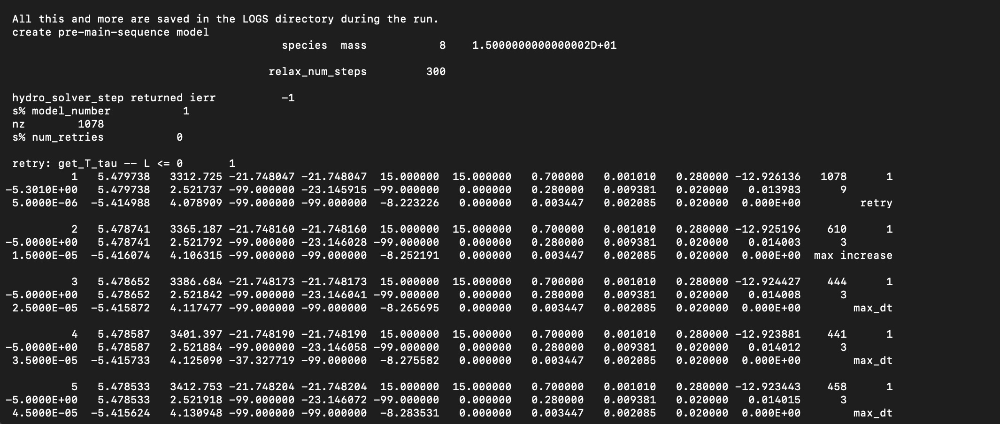
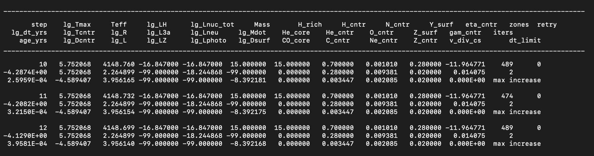
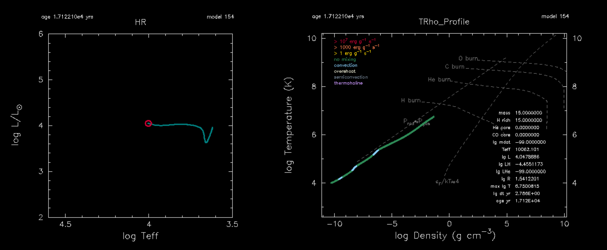
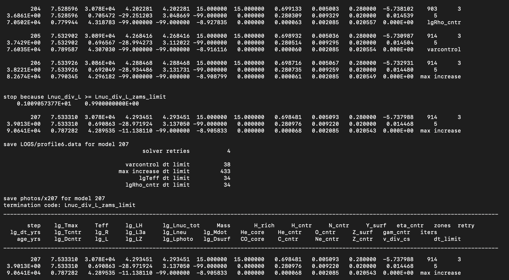
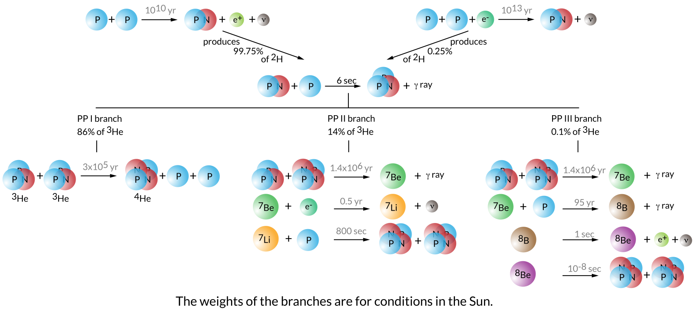
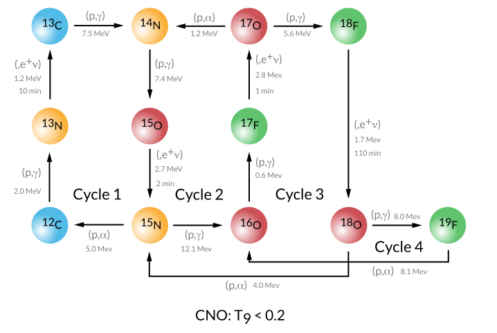
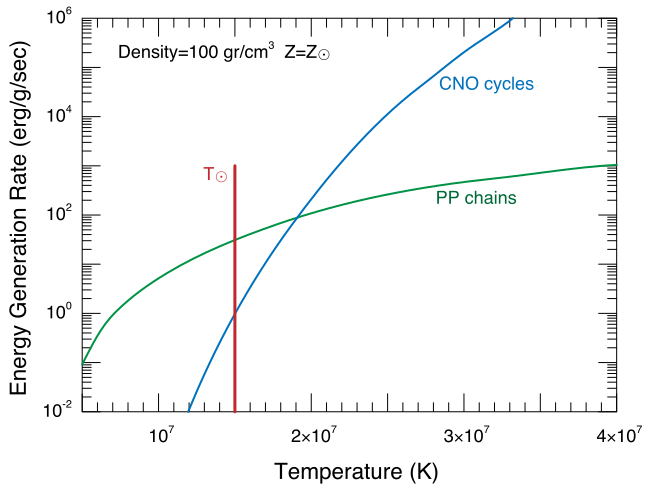
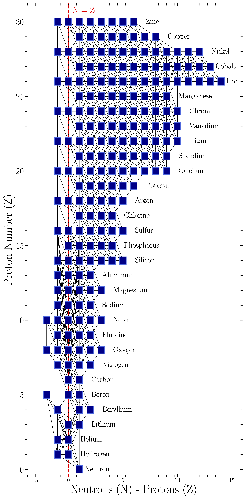

<script type="text/x-mathjax-config">MathJax.Hub.Config({tex2jax:{inlineMath:[['\$','\$'],['\\(','\\)']],processEscapes:true},CommonHTML: {matchFontHeight:false}});</script>
<script type="text/javascript" async src="https://cdnjs.cloudflare.com/ajax/libs/mathjax/2.7.1/MathJax.js?config=TeX-MML-AM_CHTML"></script>


credit: [Chiavassa et al. 2022](https://ui.adsabs.harvard.edu/abs/2022A%26A...661L...1C/abstract)

# 1. Changing Nuclear Reaction Networks

<!-- [HELP LINK for website building](./help.html) -->

[Google drive link to download Lab materials Materials](https://drive.google.com/drive/folders/1yFy2I7kBh6UZPYmhFxkZswQVPI0Qavjc?usp=share_link)

[Link to Lab Solutions](https://drive.google.com/drive/folders/11WEpwn17_XuxKugH0B57OHMjby-jomUj?usp=share_link)

## Goal of this Session

This session will cover basic usage of the MESA software instrument in the context of nuclear astrophysics. The session will focus on demonstrating how a user can setup a MESA stellar model, alter specific nuclear reaction rates, evolve the stellar model. In the next section we will experiment will attack a science case and try to interpret our results in the context of stellar evolutionary theory.

## Setting up a MESA Stellar Model

To begin, first make a project directory for this session. 

```shell-session
$ mkdir astronuc_MESA_labs
$ cd astronuc_MESA_labs
```

Next, to familiarize ourself with a MESA, let's copy the standard Star work directory from our local MESA installation into our local directory and navigate into it. Feel Free to give it a name, like `Intro_MESA_model`. 

```shell-session
$ cp -r $MESA_DIR/star/work Intro_MESA_model
$ cd Intro_MESA_model
```

To get an idea of what is inside `Intro_MESA_model` we can use the `tree` command.

The `tree` command shows the files contained in the `Intro_MESA_model` directory and its subdirectories.

If your terminal does not have `tree` installed, you  can do it by executing

```shell-session
$ brew install tree # on mac
```
or
```shell-session
$ sudo apt-get install tree # on linux
```
It's alright if you don't have `tree` or cannot download it, `ls` should suffice.

`tree ./Intro_MESA_model` should return the following.

```shell-session
├── clean
├── inlist
├── inlist_pgstar
├── inlist_project
├── make
│   └── makefile
├── mk
├── plot.py
├── re
├── README.rst
├── rn
└── src
    ├── run_star_extras.f90
    └── run.f90

3 directories, 12 files

```


### MESA STAR work directory
All relevent files are briefly described in the table below

| Filename                | Description       |
|:------------------------|:------------------|
| `clean`                 | A bash file for cleaning the model directory.       |
| `inlist`                | The header inlist which points to all other inlists to determine which inlists are read and in what order. |
| `inlist_project`               | The main inlist which contains controls for the stellar evolution of the `m1`  |
| `inlist_pgstar`         | The inlist which controls the pgstar output for the star.      |
| `make/`                  | A directory containing the makefile.   |
| `mk`                    | A bash file for compiling MESA binary and Star in the model directory.      |
| `re`                    | A bash file for restarting the binary/star model executable from photos      |
| `rn`                    | A bash file for running the star model executable.      |
| `src/`                   | A directory containing the three files listed below.      |
| `run_star_extras.f90`   | A fortran file which can be modified to agument the stellar evolution routines.     |

`inlist_project` is the main files that contain the microphysics information of our stellar evolution simulation.

## Running MESA

### Setting inlist parameters

The primary file you will be modifying is `inlist_project`

```plaintext
! inlist to evolve a 15 solar mass star

! For the sake of future readers of this file (yourself included),
! ONLY include the controls you are actually using.  DO NOT include
! all of the other controls that simply have their default values.

&star_job

   ! see star/defaults/star_job.defaults

   ! begin with a pre-main sequence model
   create_pre_main_sequence_model = .true.

   ! save a model at the end of the run
   save_model_when_terminate = .false.
   save_model_filename = '15M_at_TAMS.mod'

   ! display on-screen plots
   pgstar_flag = .true.

/ ! end of star_job namelist


&eos

   ! eos options
   ! see eos/defaults/eos.defaults

/ ! end of eos namelist


&kap

   ! kap options
   ! see kap/defaults/kap.defaults
   use_Type2_opacities = .true.
   Zbase = 0.02

/ ! end of kap namelist


&controls

   ! see star/defaults/controls.defaults

   ! starting specifications
   initial_mass = 15 ! in Msun units
   initial_z = 0.02

   ! when to stop

   ! stop when the star nears ZAMS (Lnuc/L > 0.99)
   Lnuc_div_L_zams_limit = 0.99d0
   stop_near_zams = .true.

   ! stop when the center mass fraction of h1 drops below this limit
   xa_central_lower_limit_species(1) = 'h1'
   xa_central_lower_limit(1) = 1d-3

   ! wind

   ! atmosphere

   ! rotation

   ! element diffusion

   ! mlt

   ! mixing

   ! timesteps

   ! mesh

   ! solver
   ! options for energy conservation (see MESA V, Section 3)
   energy_eqn_option = 'dedt'
   use_gold_tolerances = .true.

   ! output

/ ! end of controls namelist
```

and will allow us to set the stellar parameters, e.g., the initial mass of the star and the nuclear network. The full list of available parameters for `&star_job` can be found in the directory

```
$MESA_DIR/star/defaults/star_job.defaults
```

and those of `&controls` can be found in

```
$MESA_DIR/star/defaults/controls.defaults
```

If you would like to change any of these default values, just copy them to `inlist_project` and set the new values there.

# Running MESA

Here, we will run our first stellar model. To do this execute the below commands in your terminal

```shell-session
$ ./mk
$ ./rn
```

### Terminal Output

On executing the above commands, MESA will print the model output on the terminal. After each step the new updated values of the binaries parameters would be printed to the display. An example output is shown below.



Notice one of the first things you should see is a line indicating the stellar model is 15 M$_{\odot}$ (to double precision), and the nuclear reaction network MESA has adopted contains 8 isotopes. The model should begin with a numerical relaxation routine to generate the intial model, and then be followed by periodic terminal output describing global properties of the stellar model as it evolves and contracts.  


### Pgstar Output

A picture is worth a thousand words! Rather than reading the output from the terminal, at times, an intuitive understanding of stellar evolution can be grasped from a diagram. The `Pgstar` module does exactly that. It plots the model output in real-time - depending on the chosen step size.



The `pgstar` plots are switched on via the following flag in `&star_job` in the file `inlist_project`.

```
   pgstar_flag = .true.
```
The model should return two figures, one showing the evolution of the stellar model in the Hertzsprung-Russell Diagram and the other showing the stellar model's profile in temperature and density. If you're curious how this is done, look inside the `./inlist_pgstar`.



The model should evolve until reaching the stopping condition set inside `inlist_project`, specifically

```plaintext
   ! stop when the star nears ZAMS (Lnuc/L > 0.99)
   Lnuc_div_L_zams_limit = 0.99d0
   stop_near_zams = .true.
```



We want the stellar model to evolve through core-Hydrogen burning, and we want to visualize the evolution of the composition! To do that we'll need to change a few things in our model directory.

|:clipboard: TASK|
|:--|
|change the stopping condition in the `&controls` such that the stellar model evolves until the central hydrogen mass fraction drops below $10^{-3}$, See [MESA &controls documentation: When to stop](https://docs.mesastar.org/en/release-r25.012.1/reference/controls.html#when-to-stop).|
|Add an abundance plot to `&pgstar`, See [MESA &pgstar documentation: Abundance window](https://docs.mesastar.org/en/25.12.1/reference/pgstar.html#abundance-window).|
|Add a power plot to `&pgstar`, See [MESA &pgstar documentation: Power window](https://docs.mesastar.org/en/25.12.1/reference/pgstar.html#power-window).|
|Run the model again!|


|:information_source: HINT|
|:--|
|instead of running your model from the beginning with `./rn`, try restarting from the last binary photo, with `./re x207`|

| :question: Below are some questions to think about and discuss while your model evolves | 
| :--- |
| 1. Which isotopes or reactions dominate the energy production in the stellar model during core-Hydrogen burning?|
| 3. How do these reactions alter the central composition?|
| 4. Do we miss any reactions with our simplified 8 isotope network?|


<details markdown="block">
<summary>Answers: Change the stopping condition</summary>
Comment out the following in `&controls` inside `inlist_project`
```plaintext
   ! stop when the star nears ZAMS (Lnuc/L > 0.99)
   !Lnuc_div_L_zams_limit = 0.99d0
   !stop_near_zams = .true.
```
Add the following to `&pgstar` inside `inlist_pgstar`
```plaintext
   Abundance_win_flag = .true. ! turn on abundance window
   Power_win_flag = .true. ! turn on Power window
```


</details>

## Nuclear Reaction Networks for core-Hydrogen burning

The `net` module in MESA  implements nuclear reaction networks and is derived from publicly available code (made available thanks to [Frank Timmes](https://cococubed.com/code_pages/burn.shtml)). It includes a "basic" network of 8 isotopes: $^{1}$H, $^{3}$Не, $^{4}$He, $^{12}$C, $^{14}$N, $^{16}$O, $^{20}$Ne, and $^{24}$Mg. MESA also provides extended networks for more detailed calculations including coverage of hot CNO reactions, a-capture chains, (a,p) +(p, y) reactions, and heavy-ion reactions (See [Timmes 1999](https://ui.adsabs.harvard.edu/abs/1999ApJS..124..241T/abstract)). In addition to using existing networks, the user can create a new network by listing the desired isotopes and reactions in a data file that is read at run time, the `.net` file. 

   For further details on the net modeule in MESA, see [MESA neuclear reaction network documentation](https://docs.mesastar.org/en/25.12.1/net/nets.html), and information on [nuclear reaction rates](https://docs.mesastar.org/en/25.12.1/rates/overview.html), and the MESA instrument papers (linked on the sidebar). 

<!--The amount of heat deposited in the plasma by reactions is derived from the nuclear masses in chem, taken from the JINA Reaclib database (Rauscher & Thielemann-->
<!--2000; Sakharuk et al. 2006; Cyburt et al. 2010), and accounts for positron annihilations and energy lost to weak neutrinos, using Bahcall (1997, 2002) for the hydrogen burning reactions. The list of approximately 350 reactions is stored in a data file that catalogs the reaction name, the input and output species, and their heat release. (lines from paxton et al. 2011) -->

### Basic.net


By default MESA adopts the `basic.net` approximate network. Let's investigate more closely what reactions and isotopes are involved in this network. 

Navigate to `$MESA_DIR/data/net_data/nets/.` and open `basic.net`, it should read

```plaintext
      ! the basic net is for "no frills" hydrogen and helium burning.
      ! assumes T is low enough so can ignore advanced burning and hot cno issues.

      add_isos(
         h1 
         he3 
         he4 
         c12 
         n14 
         o16 
         ne20 
         mg24
         )
         
      add_reactions(
     
         ! pp chains
         
         rpp_to_he3          ! p(p e+nu)h2(p g)he3
         rpep_to_he3         ! p(e-p nu)h2(p g)he3     
         r_he3_he3_to_h1_h1_he4       ! he3(he3 2p)he4 
         r34_pp2             ! he4(he3 g)be7(e- nu)li7(p a)he4 
         r34_pp3             ! he4(he3 g)be7(p g)b8(e+ nu)be8( a)he4  
         r_h1_he3_wk_he4               ! he3(p e+nu)he4     

         ! cno cycles
         
         rc12_to_n14         ! c12(p g)n13(e+nu)c13(p g)n14
         rn14_to_c12         ! n14(p g)o15(e+nu)n15(p a)c12
         rn14_to_o16         ! n14(p g)o15(e+nu)n15(p g)o16
         ro16_to_n14         ! o16(p g)f17(e+nu)o17(p a)n14

         ! helium burning
         
         r_he4_he4_he4_to_c12

         r_c12_ag_o16
         rc12ap_to_o16       ! c12(a p)n15(p g)o16    

         rn14ag_lite         ! n14 + 1.5 alpha = ne20

         r_o16_ag_ne20
         ro16ap_to_ne20      ! o16(a p)f19(p g)ne20    

         r_ne20_ag_mg24
         rne20ap_to_mg24     ! ne20(a p)na23(p g)mg24

         ! auxiliaries -- used only for computing rates of other reactions
         
         rbe7ec_li7_aux 
         rbe7pg_b8_aux 
         rn14pg_aux 
         rn15pg_aux 
         rn15pa_aux 
         ro16ap_aux 
         rf19pg_aux 
         rf19pa_aux 
         rne20ap_aux 
         rna23pg_aux 
         rna23pa_aux

         rc12ap_aux               ! c12(ap)n15                 
         rn15pg_aux               !        n15(pg)o16           
         ro16gp_aux               ! o16(gp)n15                
         rn15pa_aux               !        n15(pa)c12
           
         )     
```

Core-Hydrogen burning is characterized by two key processes:


The proton-proton chain: 
 
PP I, II, II, and pep chains are visualized here

 
and the Carbon-Nitrogen-Oxygen (CNO) Cyles:
 
CNO I, II, III, and IV cycles visualized here



Because the temperature sensitivity of the CNO cycle nuclear reactions increase more steeply with temperature $\epsilon_{CNO} \propto T^{17}$, as opposed to $\epsilon_{pp} \propto T^{4}$, Hotter stellar models are dominated by CNO cycle nuclear reactions. 

|:question: Where does our stellar model lie in the diagram below?| 



<details markdown="block">
<summary>Answers: Where does our model live in the diagram </summary>
Our model lives far to the right at high core temperatures $T \sim 30 $ MK, and is dominated by CNO cycle nuclear reactions.
</details>

### Other Hardwired networks

The Basic.net network might not be capturing all the nucleosynthetic processes we are trying to study, 

| :question: Which isotopes in the four CNO cycles visualized above are missing from our `basic.net`?|
| Which isotopes in the four CNO cycles visualized above are missing from our `basic.net`?|
| If we wanted to switch to a slightly more detailed network, how would we do it?|


Let's inspect some of the other network files available in MESA `$MESA_DIR/data/net_data/nets/`. Since we are only evolving our stellar model through core-Hydrogen burning, perhaps we should select a network that is more specific to this phase of evolution?  

Looking inside `pp_and_cno_extras.net`, we find that this network adopts `basic.net` as before but adds in additional isotopes and reactions to resolve pp and cno burning.

```plaintext
      include 'basic.net'
   
      include 'add_pp_extras'

      include 'add_cno_extras'
```

|:clipboard: TASK|
|:--|
|Look at 'add_pp_extras' and 'add_pp_extras'.|
|change the nuclear reaction network in `&star_job` to adopt `pp_and_cno_extras.net`!See [MESA &starjob documentation: changing networks](https://docs.mesastar.org/en/25.12.1/reference/star_job.html#change-initial-net).|
|Run the model again!|

Are there any notable changes in your model's properties or behavior? How does the run time of your MESA Calculation change?


### Generalized Networks

| :question: How do you adopt a general network? See[MESA neuclear reaction network documentation](https://docs.mesastar.org/en/25.12.1/net/nets.html)| 


|:clipboard: Bonus TASK|
|:--|
|Try switching to a generalized network.|
|change the nuclear reaction network in `&starjob` to adopt `mesa_28.net`!See [MESA &starjob documentation: When to stop](https://docs.mesastar.org/en/25.12.1/reference/star_job.html#change-initial-net).|
|Run the model again, and take note of the run time difference!|

Below are the contents of `mesa_28.net`.
```plaintext

add_isos_and_reactions(
   neut
    h  1  2 ! hydrogen
   he  3  4 ! helium
   li7      ! lithium
   be7
   be  9 10 ! berylium
    b8      ! boron
    c 12 13 ! carbon
    n 13 15 ! nitrogen
    o 14 18 ! oxygen
    f 17 19 ! fluorine
   ne 18 22 ! neon
   )
```


|:information_source: Building your own network file|
|:--|
| If you make your own network, the .net file can be does not need to live inside `$MESA_DIR/nets/data/net_data`. You can place the network file inside your local MESA model directory.|



For modeling more complex nuclear reaction, during advanced burning stages, refer to [Farmer et al. 2016](https://ui.adsabs.harvard.edu/abs/2016ApJS..227...22F/abstract)
