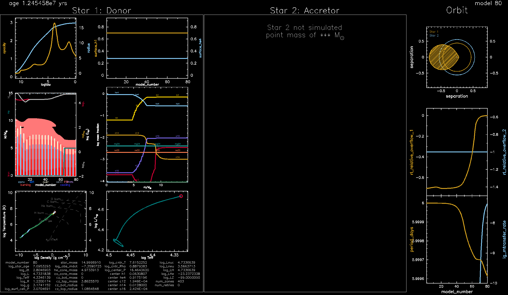

credit: [Chiavassa et al. 2022](https://ui.adsabs.harvard.edu/abs/2022A%26A...661L...1C/abstract)

# Introduction

<!-- [HELP LINK for website building](./help.html) -->

[Google drive link to download Lab materials Materials](https://drive.google.com/drive/folders/1yFy2I7kBh6UZPYmhFxkZswQVPI0Qavjc?usp=share_link)

[Link to Lab Solutions](https://drive.google.com/drive/folders/11WEpwn17_XuxKugH0B57OHMjby-jomUj?usp=share_link)

## Goal of this Session

This session will cover basic usage of the MESA software instrument in the context of nuclear astrophysics. The session will focus on demonstrating how a user can setup a MESA stellar model, alter specific nuclear reaction rates, evolve the stellar model, and interpret the results in the context of stellar evolutionary theory and observational constraints.

## Setting up a MESA Stellar Model

To begin, please download a copy of the desired [Lab1](https://drive.google.com/file/d/1p7A4C0r1Be3CPxPLLIVNXZTVtVWccvze/view?usp=share_link) MESA work directory.
This work directory is a slightly modified version of the `$MESA_DIR/star/test_suite/20M_pre_ms_to_cc` test_suite.

Once downloaded, you can decompress the file by
```shell-session
$ unzip Lab1.zip
```

To get an idea of what is inside `Lab1` we can use the `tree` command.

The `tree` command shows the files contained in the `Lab1_binary` directory and its subdirectories.

If your terminal does not have `tree` installed, you  can do it by executing

```shell-session
$ brew install tree # on mac
```
or
```shell-session
$ sudo apt-get install tree # on linux
```
It's alright if you don't have `tree` or cannot download it, `ls` should suffice.

`tree ./Lab1` should return the following.

```shell-session
├── clean
├── history_columns.list
├── inlist
├── inlist_common
├── inlist_make_late_pre_zams
├── inlist_make_late_pre_zams_header
├── inlist_mass_Z_wind_rotation
├── inlist_pgstar
├── inlist_to_cc
├── inlist_to_cc_header
├── inlist_to_zams
├── inlist_to_zams_header
├── make
│   └── makefile
├── mk
├── profile_columns.list
├── rate_tables
│   ├── c12ag_deboer_sigma_0p0_2000_Tgrid.dat
│   ...
├── re
├── re_nomodfiles
├── README.rst
├── rn
├── rn_all
├── rn_lab
├── rn_nomodfiles
├── rn_standard
├── rn1
├── run_all
├── src
│   ├── run_star_extras.f90
│   └── run.f90
├── standard_late_pre_zams.mod
├── standard_zams.mod
└── zams.mod
```


All files are briefly described in the table below

### MESA STAR work directory

| Filename                | Description       |
|:------------------------|:------------------|
| `clean`                 | A bash file for cleaning the model directory.       |
| `inlist`                | The header inlist which points to all other inlists to determine which inlists are read and in what order. |
| `inlist1`               | The main inlist which contains controls for the stellar evolution of the `m1`  |
| `inlist2`               | The main inlist which contains controls for the stellar evolution of the `m2`     |
| `inlist_pgbinary`       | The inlist which controls the pgstar output for the binary evolution.      |
| `inlist_pgstar`         | The inlist which controls the pgstar output for each single star.      |
| `inlist_project`        | The main inlist which contains controls for the evolution of the binary |
| `make/`                  | A directory containing the makefile.   |
| `mk`                    | A bash file for compiling MESA binary and Star in the model directory.      |
| `history_columns.list`  | A log file which determines which history values are saved in data files as a function of model timestep. |
| `profile_columns.list`       | A log file which determines which profiles values are saved in data files as a function of Mass/radius.     |
| `re`                    | A bash file for restarting the binary/star model executable from photos      |
| `rn`                    | A bash file for running the binary/star model executable.      |
| `src/`                   | A directory containing the three files listed below.      |
| `binary_run.f90`        | A fortran file for running the binary model.      |
| `run_binary_extras.f90` | A fortran file which can be modified to agument the binary evolution routines.      |
| `run_star_extras.f90`   | A fortran file which can be modified to agument the stellar evolution routines.     |

`inlist_project`, `inlist1`, and `inlist2` are the three main files that contain the microphysics information of our binary stellar evolution simulation.

## Setting the stellar parameters

### Binary parameters

The primary file you will be modifying is `inlist_to_cc` - which is relevant for binary parameters -  will look something like this

```plaintext
&binary_job

   inlist_names(1) = 'inlist1' 
   inlist_names(2) = 'inlist2'

   evolve_both_stars = .false.

   ! save_model_when_terminate = .true.
   ! save_model_filename = 'TAMS_model.dat'

   pgbinary_flag = .true.

/ ! end of binary_job namelist

&binary_controls
   

   m1 = 15d0  ! donor mass in Msun
   m2 = 12d0 ! companion mass in Msun
   initial_period_in_days = 6d0

   ! Mass transfer efficiency controls
!   defaults are 0
!   mass_transfer_alpha = 0d0      ! fraction of mass lost from the vicinity of donor as fast wind
!   mass_transfer_beta = 0.6d0     ! fraction of mass lost from the vicinity of accretor as fast wind
!   mass_transfer_delta = 0.1d0    ! fraction of mass lost from circumbinary coplanar toroid
!   mass_transfer_gamma = 1.2d0    ! radius of the circumbinary coplanar toroid is ``gamma**2 * orbital_separation``

   limit_retention_by_mdot_edd = .false. ! for evolution with a compact object

   ! Mass transfer scheme
   mdot_scheme = "Kolb" ! default is 'Ritter'

   ! relax timestep controls
   fr = 0.2 !0.05        ! change of relative Roche lobe gap (default 0.01)
   fr_dt_limit = 5d2     ! Mimumum timestep limit allowed for fr in years
   fj = 0.05             ! change of orbital angular momentum
   fm = 0.05   ! default 0.01, envelope mass
   fdm = 0.05  ! default 0.005, fractional mass change of either star
   fa = 0.05   ! default 0.01, binary separation
   fdm_hard = 0.1
   fr_limit = 1d-3

   ! Magentic braking
   do_jdot_mb = .false.


   min_mdot_for_implicit = 1d-7
   implicit_scheme_tolerance = 1d-1
   max_tries_to_achieve = 50
   report_rlo_solver_progress = .false.


   ! Allow for evolution even when accretor overflows
   ! terminate evolution if (r-rl)/rl is bigger than this for accretor
   accretor_overflow_terminate = 1d3 


! output frequency section:
       photo_interval         = 50
       photo_digits           = 6
       history_interval       = 1
       terminal_interval      = 10
       write_header_frequency = 10

         
/ ! end of binary_controls namelist
```

and will allow us to set the binary parameters, e.g., the initial mass of the stars and their orbital period. The full list of available parameters for `&binary_job` can be found in the directory

```
$MESA_DIR/binary/defaults/binary_job.defaults
```

and those of `&binary_controls` can be found in

```
$MESA_DIR/binary/defaults/binary_controls.defaults
```

If you would like to change any of these default values, just copy them to `inlist_project` and set the new values there.

### Parameters of the component stars

Any (non-default) values for the parameters of the individual stars will be set in the `inlist1` (for primary star) and `inlist2` (for secondary star) files. The more massive star is considered as the primary star and dictates the initial evolution of the binary system. An example of the contents in `inlist1` is

```plaintext
&star_job

      show_log_description_at_start = .false.
      save_model_when_terminate = .true.
      save_model_filename = 'donar_final.mod'


/ ! end of star_job namelist

&eos

/ ! end of eos namelist

&kap
Zbase = 0.02

/ ! end of kap namelist


&controls
   max_model_number = 3500

      ! help the envelope carry energy to 
      ! the surface for solar metallicity
      use_superad_reduction = .true.
      superad_reduction_Gamma_limit = 0.5d0
      superad_reduction_Gamma_limit_scale = 5d0
      superad_reduction_Gamma_inv_scale = 5d0
      superad_reduction_diff_grads_limit = 1d-2
      superad_reduction_limit = -1d0

      ! we use step overshooting
      overshoot_scheme(1) = 'step'
      overshoot_zone_type(1) = 'burn_H'
      overshoot_zone_loc(1) = 'core'
      overshoot_bdy_loc(1) = 'top'
      overshoot_f(1) = 0.345
      overshoot_f0(1) = 0.01

      ! a bit of exponential overshooting for convective core during He burn
      overshoot_scheme(2) = 'exponential'
      overshoot_zone_type(2) = 'burn_He'
      overshoot_zone_loc(2) = 'core'
      overshoot_bdy_loc(2) = 'top'
      overshoot_f(2) = 0.01
      overshoot_f0(2) = 0.005

      use_ledoux_criterion = .true.
      alpha_semiconvection = 1d0


      extra_terminal_output_file = 'log1' 
      log_directory = 'LOGS1'

      
      ! reduce resolution and solver tolerance to make runs faster
      mesh_delta_coeff = 2.5d0
      time_delta_coeff = 2.5d0
      varcontrol_target = 1d-3
      use_gold2_tolerances = .true.
      use_gold_tolerances = .true.

      xa_central_lower_limit_species(1) = 'he4'
      xa_central_lower_limit(1) = 1d-4


      ! output frequency section:
       photo_interval         = 50
       photo_digits           = 6
       profile_interval       = 200 ! 
       max_num_profile_models = 400000
       history_interval       = 1
       terminal_interval      = 10
       write_header_frequency = 10

/ ! end of controls namelist


&pgstar
   read_extra_pgstar_inlist(1) = .true.
   extra_pgstar_inlist_name(1)= 'inlist_pgstar'

/ ! end of pgstar namelist
```

Many other (default) parameters which are not modified in the above inlist can be found in the directory

```
$MESA_DIR/star/defaults/
```

As before copy the relevant parameter you wish to change to `inlist1` before making the change. Similarly, `inlist2` contains the parameters of star 2.

# Setting values for an initial run

Here, we will run our first model. For this, we need to set the masses of the stars in the binary and the binary's orbit period. Choose a desired value and then execute the below commands in your terminal

```shell-session
$ ./mk
$ ./rn
```

### Terminal Output

On executing the above commands, MESA will print the model output on the terminal. After each step the new updated values of the binaries parameters would be printed to the display. An example output is shown below.


### Pgstar Output

A picture is worth a thousand words! Rather than reading the output from the terminal, at times, an intuitive understanding of stellar evolution can be grasped from a diagram. The `Pgstar` module does exactly that. It plots the model output in real-time - depending on the chosen step size.

The `pgbinary` plots are switched on via the following flag in `&binary_job` in the file `inlist_project`.

```
   pgbinary_flag = .true.
```
We also want to try running this model in single star mode, so we have set `evolve_both_stars = .false.` as well.

This model directory "should" return a nice pgbinary plot showing the evolution of the primary with the secondary treated as a point mass. The main panel on the left for the primary should display a variety of plots for that star, while the second panel for the secondary does not appear as it is not being modeled here. An orbital seperation diagram should appear in the top right corner followed by other plots of the orbital evolution of both stars.



Now let's try to reproduce a similar pgbinary plot. We can `./mk` and `./rn` our binary directory to watch the evolution of a 15Msun star orbiting a point mass. Run your model and take note of what happens to your model and/or the models of the others at your table. Only run your model for a several tens of timesteps to see what happens. 

Discuss what happened with the the others at your table. Take note of what kind of computer are each of you using.
