<script type="text/x-mathjax-config">MathJax.Hub.Config({tex2jax:{inlineMath:[['\$','\$'],['\\(','\\)']],processEscapes:true},CommonHTML: {matchFontHeight:false}});</script>
<script type="text/javascript" async src="https://cdnjs.cloudflare.com/ajax/libs/mathjax/2.7.1/MathJax.js?config=TeX-MML-AM_CHTML"></script>


For a new MESA user, in no particular order, some ways to learn more about MESA controls are to:
Read the instrument papers ([Paxton et al. 2011](https://ui.adsabs.harvard.edu/abs/2011ApJS..192....3P/abstract), [Paxton et al. 2013](https://ui.adsabs.harvard.edu/abs/2013ApJS..208....4P/abstract), [Paxton et al. 2015](https://ui.adsabs.harvard.edu/abs/2015ApJS..220...15P/abstract), [Paxton et al. 2018](https://ui.adsabs.harvard.edu/abs/2018ApJS..234...34P/abstract), [Paxton et al. 2019](https://ui.adsabs.harvard.edu/abs/2019ApJS..243...10P/abstract), [Jermyn et al. 2023](https://ui.adsabs.harvard.edu/abs/2023ApJS..265...15J/abstract))
Read the [MESA reference documentation](https://docs.mesastar.org/en/25.12.1/reference.html) (and look at how the controls are implemented internally)
Attend (or work through a previous) [MESA Summer School](https://mesastar.org/summer-schools/) for hands-on training and engagement with the broader community
(most importantly), run MESA and investigate things directly yourself. Check out the test_suite examples in `$MESA_DIR/star/test_suite` and `$MESA_DIR/binary/test_suite`. Keep in mind, the test_suite examples are optimized for speed, not science, so one must be careful in mapping the test cases to a particular science application.

There is no monolithic method to learn MESA and it is a very large software instrument. One method is to narrow down on a particular science problem you are interested in studying, and then to find test_cases inside MESA which study similar problems, and investigate those controls. Read literature which studies said topic using MESA, and then investigate what those authors adopt in their inlists to study those types of problems. Inlists from published works can be found on [MESA-contrib](https://mesastar.org/marketplace/inlists/) and [MESA-Zenodo](https://zenodo.org/communities/mesa/records?q=&l=list&p=1&s=10).
 
 
# 1. Changing Nuclear Reaction Networks

<!-- [HELP LINK for website building](./help.html) -->

[Google drive link to download Lab materials Materials](https://drive.google.com/file/d/19_R2QITiDjMbPmCc-rnObhKKcITtbohT/view?usp=sharing)

## Goal of this Session

This session will cover basic usage of the MESA software instrument in the context of nuclear astrophysics. The session will focus on demonstrating how a user can setup a MESA stellar model, alter specific nuclear reaction rates, evolve the stellar model. In the next section we will experiment will attack a science case and try to interpret our results in the context of stellar evolutionary theory.

## Setting up a MESA Stellar Model

To begin, first make a project directory for this session. 

```shell-session
mkdir astronuc_MESA_labs
cd astronuc_MESA_labs
```

Next, to familiarize ourself with a MESA, let's copy the standard Star work directory from our local MESA installation into our local directory and navigate into it. Feel Free to give it a name, like `Intro_MESA_model`. 

```shell-session
cp -r $MESA_DIR/star/work Intro_MESA_model
cd Intro_MESA_model
```

To get an idea of what is inside `Intro_MESA_model` we can use the `tree` command.

The `tree` command shows the files contained in the `Intro_MESA_model` directory and its subdirectories.

OPTIONAL: If your terminal does not have `tree` installed, you  can do it by executing

```shell-session
brew install tree # on mac
```
or
```shell-session
sudo apt-get install tree # on linux
```
It's alright if you don't have `tree` or cannot download it, `ls` should suffice.

`tree ./Intro_MESA_model` should return the following.

```shell-session
├── clean
├── inlist
├── inlist_pgstar
├── inlist_project
├── make
│   └── makefile
├── mk
├── plot.py
├── re
├── README.rst
├── rn
└── src
    ├── run_star_extras.f90
    └── run.f90

3 directories, 12 files

```


### MESA STAR work directory
All relevent files are briefly described in the table below

| Filename                | Description       |
|:------------------------|:------------------|
| `clean`                 | A bash file for cleaning the model directory.       |
| `inlist`                | The header inlist which points to all other inlists to determine which inlists are read and in what order. |
| `inlist_project`               | The main inlist which contains controls for the stellar evolution of the `m1`  |
| `inlist_pgstar`         | The inlist which controls the pgstar output for the star.      |
| `plot.py`         | A simple python script for plotting output from the `LOGS/` directory.      |
| `make/`                  | A directory containing the makefile.   |
| `mk`                    | A bash file for compiling MESA Star executable in the model directory.      |
| `re`                    | A bash file for restarting the star model executable from photos      |
| `rn`                    | A bash file for running the star model executable.      |
| `src/`                   | A directory containing the three files listed below.      |
| `run_star_extras.f90`   | A fortran file which can be modified to agument the stellar evolution routines.     |


`inlist_project` is the main file that contain the microphysics information of our stellar evolution simulation, and the one you will be working with most.

## Running MESA

### Setting inlist parameters

The primary file you will be modifying is `inlist_project`

```plaintext
! inlist to evolve a 15 solar mass star

! For the sake of future readers of this file (yourself included),
! ONLY include the controls you are actually using.  DO NOT include
! all of the other controls that simply have their default values.

&star_job

   ! see star/defaults/star_job.defaults

   ! begin with a pre-main sequence model
   create_pre_main_sequence_model = .true.

   ! save a model at the end of the run
   save_model_when_terminate = .false.
   save_model_filename = '15M_at_TAMS.mod'

   ! display on-screen plots
   pgstar_flag = .true.

/ ! end of star_job namelist


&eos

   ! eos options
   ! see eos/defaults/eos.defaults

/ ! end of eos namelist


&kap

   ! kap options
   ! see kap/defaults/kap.defaults
   use_Type2_opacities = .true.
   Zbase = 0.02

/ ! end of kap namelist


&controls

   ! see star/defaults/controls.defaults

   ! starting specifications
   initial_mass = 15 ! in Msun units
   initial_z = 0.02

   ! when to stop

   ! stop when the star nears ZAMS (Lnuc/L > 0.99)
   Lnuc_div_L_zams_limit = 0.99d0
   stop_near_zams = .true.

   ! stop when the center mass fraction of h1 drops below this limit
   xa_central_lower_limit_species(1) = 'h1'
   xa_central_lower_limit(1) = 1d-3

   ! wind

   ! atmosphere

   ! rotation

   ! element diffusion

   ! mlt

   ! mixing

   ! timesteps

   ! mesh

   ! solver
   ! options for energy conservation (see MESA V, Section 3)
   energy_eqn_option = 'dedt'
   use_gold_tolerances = .true.

   ! output

/ ! end of controls namelist
```

and will allow us to set the stellar parameters, e.g., the initial mass of the star and the nuclear network. The full list of available parameters for `&star_job` can be found in the directory

```
$MESA_DIR/star/defaults/star_job.defaults
```

and those of `&controls` can be found in

```
$MESA_DIR/star/defaults/controls.defaults
```

If you would like to change any of these default values, just copy them to `inlist_project` and set the new values there.

# Running MESA

Here, we will run our first stellar model. To do this execute the below commands in your terminal

```shell-session
./mk
./rn
```

### Terminal Output

On executing the above commands, MESA will print the model output on the terminal. After each step the new updated values of the binaries parameters would be printed to the display. An example output is shown below.

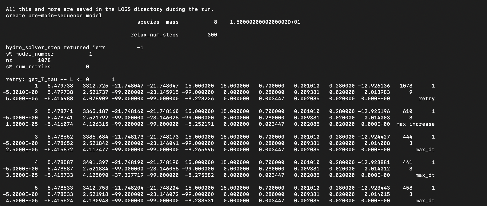
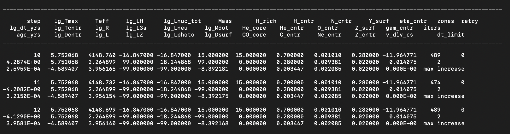

Notice one of the first things you should see is a line indicating the stellar model is 15 M$_{\odot}$ (to double precision), and the nuclear reaction network MESA has adopted contains 8 isotopes. The model should begin with a numerical relaxation routine to generate the intial model, and then be followed by periodic terminal output describing global properties of the stellar model as it evolves and contracts.  


### Visualizing MESA Output with Pgstar and Python Scripts.

MESA default mode is to output data to the `LOGS` directory. This directory typically contains two main types of files, the `history.data` file containing global properties of the model at each timestep and the `profile.data` files each containing radial snapshots of the stellar structure at given times. We reccomend you stop here and read the [MESA Output documentation](https://docs.mesastar.org/en/25.12.1/using_mesa/output.html). A python file `plot.py` is available in the your directory which can read in your mesa output and produce plots. You are welcome to use this script and play with plotting different quantites from the mesa. You likely have python installed since it is a necesary component to installing MESA, however you might not have the necessary python packages. The `plot.py` scripts uses both [matplotlib](https://matplotlib.org/) and [py_mesa_reader](https://billwolf.space/py_mesa_reader/). These packages can be installed via `pip install` or `conda install` if you have anaconda installed. 
    
    You can also easily set up a virtual environment with anaconda: 
    
shell-session
```
conda create -n mesa_plot python=3.11 matplotlib mesa_reader
conda activate mesa_plot
```

or without anaconda

shell-session
```
python3 -m venv mesa_plot_env
source mesa_plot_env/bin/activate
pip install matplotlib mesa_reader
```

    
|:clipboard: OPTIONAL TASK (for those with mesa_reader and matplotlib installed)|
|:--|
|Run the python script.|

shell-session
```python plot.py``` 
or 
shell-session
```python3 plot.py```

<details markdown="block">
<summary>Answers: Run the python script </summary>

When you run the script a Hertzsprung-Russel diagram should appear along with a profile plot of the stellar density versus mass.
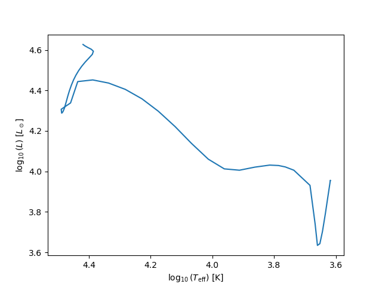
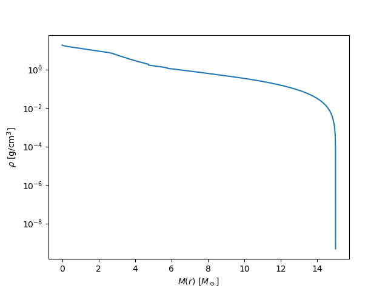
</details>

    
A picture is worth a thousand words! For this lab, rather staring at the output from the terminal and running plotting scripts after the fact for individual quantities. Let's make  use of the `Pgstar` module to help give ourselves an intuitive understanding of models while they run. The `Pgstar` module plots the model output in real-time - depending on the chosen step size. The `Pgstar` module also produces png files which can be combined into movies we can interpret relatively easily.

The `pgstar` plots are switched on via the following flag in `&star_job` in the file `inlist_project`.

```
   pgstar_flag = .true.
```
The model should return two figures, one showing the evolution of the stellar model in the Hertzsprung-Russell Diagram and the other showing the stellar model's profile in temperature and density. If you're curious how this is done, look inside the `./inlist_pgstar`.

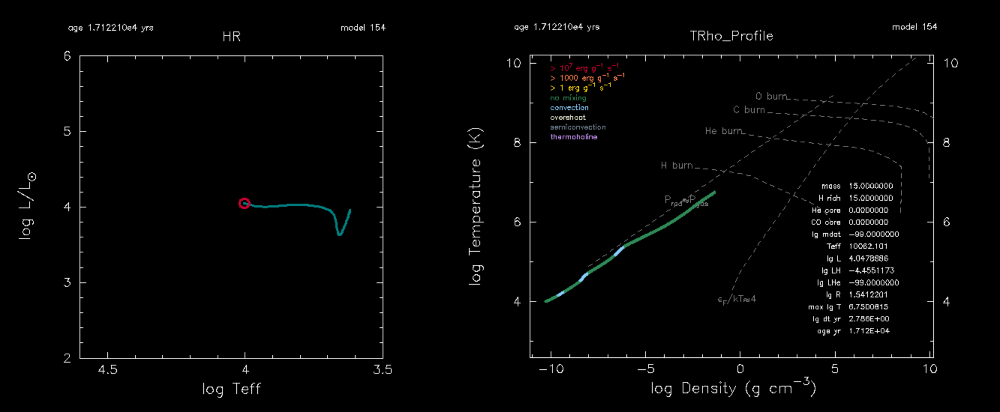

The model should evolve until reaching the stopping condition set inside `inlist_project`, specifically

```plaintext
   ! stop when the star nears ZAMS (Lnuc/L > 0.99)
   Lnuc_div_L_zams_limit = 0.99d0
   stop_near_zams = .true.
```

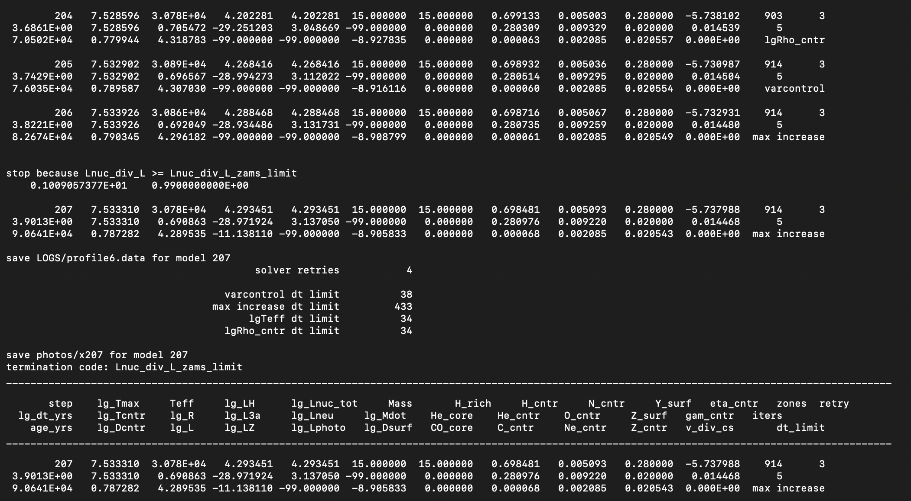

We want the stellar model to evolve through core-Hydrogen burning, and we want to visualize the evolution of the composition! To do that we'll need to change a few things in our model directory.

|:clipboard: TASK|
|:--|
|change the stopping condition in the `&controls` such that the stellar model evolves until the central hydrogen mass fraction drops below $10^{-3}$, See [MESA &controls documentation: When to stop](https://docs.mesastar.org/en/25.12.1/reference/controls.html#when-to-stop).|
|Add an abundance plot to `&pgstar`, See [MESA &pgstar documentation: Abundance window](https://docs.mesastar.org/en/25.12.1/reference/pgstar.html#abundance-window).|
|Add a power plot to `&pgstar`, See [MESA &pgstar documentation: Power window](https://docs.mesastar.org/en/25.12.1/reference/pgstar.html#power-window).|
|Run the model again!|


|:information_source: HINT|
|:--|
|instead of running your model from the beginning with `./rn`, try restarting from the last binary photo, with `./re x207`|


<details markdown="block">
<summary>Answers: Change the stopping condition</summary>
Comment out the following in `&controls` inside `inlist_project`
```plaintext
   ! stop when the star nears ZAMS (Lnuc/L > 0.99)
   !Lnuc_div_L_zams_limit = 0.99d0
   !stop_near_zams = .true.
```
Add the following to `&pgstar` inside `inlist_pgstar`
```plaintext
   Abundance_win_flag = .true. ! turn on abundance window
   Power_win_flag = .true. ! turn on Power window
```
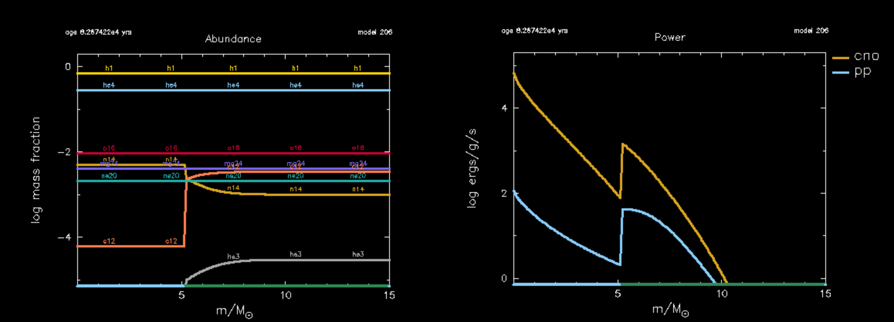

</details>

Notice, when the run completes, the pgstar window closes, making it difficult to analyze our stellar models, without directly plotting the outputs saved in the `LOGS` directory.

Let's use a more detailed pgstar for the evolution of this model.
You can paste in the `inlist_pgstar` lines provided below into your local `inlist_pgstar`. This pgstar requires us to add a couple history columns to history output file, So mixing regions are added to our history files, allowing us to visualize the Kippenhahn diagram. 

<details markdown="block">
<summary>inlist_pgstar: Copy and paste this pgstar into yours</summary>

Copy and paste this pgstar into your `inlist_pgstar`.

```plaintext
&pgstar
   !pause = .true.
   !pgstar_show_log_age_in_years = .true.
   pgstar_show_age_in_years = .true.
   ! if true, the code waits for user to enter a RETURN on the command line

   file_white_on_black_flag = .true. 
   win_white_on_black_flag = .true.

   file_device = 'png'

   Grid2_win_flag = .true.
   Grid2_num_cols = 7 ! divide plotting region into this many equal width cols
   Grid2_num_plots = 7
   Grid2_num_rows = 7
   Grid2_win_width = 10 ! controls the size of the window 
   !Grid2_win_aspect_ratio = 0.5 ! aspect_ratio = height/width
   Grid2_xleft = 0.05 ! fraction of full window width for margin on left
   Grid2_xright = 0.99 ! fraction of full window width for margin on right
   Grid2_ybot = 0.17 ! fraction of full window width for margin on bottom
   Grid2_ytop = 0.96 ! fraction of full window width for margin on top
   show_TRho_Profile_eos_regions = .true.

   Grid2_file_flag = .true.
   Grid2_file_dir = 'png'
   Grid2_file_prefix = 'Grid'
   Grid2_file_interval = 1

   Grid2_file_width = 27

   !Grid2_file_aspect_ratio = 0.7


   Grid2_plot_name(1) = 'TRho_Profile'
   Grid2_plot_row(1) = 1
   Grid2_plot_rowspan(1) =5
   Grid2_plot_col(1) = 1
   Grid2_plot_colspan(1) = 4
   Grid2_plot_pad_left(1) = 0.02
   Grid2_plot_pad_right(1) = 0.0
   Grid1_plot_pad_top(1) = 0.025
   Grid2_plot_pad_bot(1) = 0.15
   Grid2_txt_scale_factor(1) = 0.65

   Grid2_plot_name(2) = 'HR'
   Grid2_plot_row(2) = 5
   Grid2_plot_rowspan(2) = 3
   Grid2_plot_col(2) = 1
   Grid2_plot_colspan(2) = 2

   Grid2_plot_pad_left(2) = 0.01
   Grid2_plot_pad_right(2) = 0.02
   Grid2_plot_pad_top(2) = 0.04
   Grid2_plot_pad_bot(2) = 0.00
   Grid2_txt_scale_factor(2) = 0.5


   Grid2_plot_name(3) = 'Abundance'
   Grid2_plot_row(3) = 1
   Grid2_plot_rowspan(3) = 4
   Grid2_plot_col(3) = 5
   Grid2_plot_colspan(3) = 3


   Grid2_plot_pad_left(3) = 0.08
   Grid2_plot_pad_right(3) = 0.005
   Grid2_plot_pad_top(3) = 0.00
   Grid2_plot_pad_bot(3) = 0.08
   Grid2_txt_scale_factor(3) = 0.5
   Abundance_legend_max_cnt = 0
   Abundance_legend_txt_scale_factor = 0.7


   show_TRho_annotation1 = .true.
   show_TRho_annotation2 = .true.
   show_TRho_annotation3 = .true.
   show_TRho_degeneracy_line = .true.


   Grid2_plot_name(4) = 'Text_Summary1'
   Grid2_plot_row(4) = 7
   Grid2_plot_rowspan(4) = 2
   Grid2_plot_col(4) = 1
   Grid2_plot_colspan(4) = 7
   Grid2_plot_pad_left(4) = -0.05
   Grid2_plot_pad_right(4) = 0.0
   Grid2_plot_pad_top(4) = 0.21
   Grid2_plot_pad_bot(4) = -0.07
   Grid2_txt_scale_factor(4) = 0.18
   Text_Summary1_num_rows = 4 ! <= 20

   Text_Summary1_num_cols = 4 ! <= 20
   Text_Summary1_name(:,:) = ''

   Text_Summary1_name(1,1) = 'photosphere_r'
   ! Text_Summary1_name(1,2) = 'surf_avg_v_rot'
   ! Text_Summary1_name(1,3) = 'surf_avg_v_div_v_crit'
   Text_Summary1_name(1,4) = 'star_mass'

   Text_Summary1_name(2,1) = 'num_zones'
   Text_Summary1_name(2,2) = ''
   Text_Summary1_name(2,3) = 'star_age'
   Text_Summary1_name(2,4) = 'model_number'

   !  Text_Summary1_name(3,1) = 'log_total_angular_momentum'


   Grid2_plot_name(5) = 'History_Panels1'
   Grid2_plot_row(5) = 1
   Grid2_plot_rowspan(5) = 9
   Grid2_plot_col(5) = 8
   Grid2_plot_colspan(5) = 3
   Grid2_plot_pad_left(5) = 0.075
   Grid2_plot_pad_right(5) = 0.04
   Grid2_plot_pad_top(5) = 0.0
   Grid2_plot_pad_bot(5) = 0.05
   Grid2_txt_scale_factor(5) = 0.5

   History_Panels1_num_panels = 1

   History_Panels1_xaxis_name = 'model_number'
   History_Panels1_yaxis_name(1) = 'log_L'
   History_Panels1_yaxis_reversed(1) = .false.
   History_Panels1_ymin(1) = -101d0
   History_Panels1_ymax(1) = -101d0
   History_Panels1_max_width = 500
   History_Panels1_dymin(1) = -1
   History_Panels1_other_yaxis_name(1) = 'log_R'
   History_Panels1_other_yaxis_reversed(1) = .false.
   History_Panels1_other_ymin(1) = -101d0
   History_Panels1_other_ymax(1) = -101d0
   History_Panels1_other_dymin(1) = -1


   History_Panels1_yaxis_name(2) = ''
   History_Panels1_yaxis_reversed(2) = .false.
   History_Panels1_ymin(2) = -101d0
   History_Panels1_ymax(2) = -101d0
   History_Panels1_dymin(2) = -1
   History_Panels1_other_yaxis_name(2) = ''
   History_Panels1_other_yaxis_reversed(2) = .false.
   History_Panels1_other_ymin(2) = -101d0
   History_Panels1_other_ymax(2) = -101d0
   History_Panels1_other_dymin(2) = -1


   History_Panels1_yaxis_name(3) = ''
   History_Panels1_yaxis_reversed(3) = .false.
   History_Panels1_ymin(3) = -101d0
   History_Panels1_ymax(3) = -101d0
   History_Panels1_dymin(3) = -1
   History_Panels1_other_yaxis_name(3) = ''
   History_Panels1_other_yaxis_reversed(3) = .false.
   History_Panels1_other_ymin(3) = -101d0
   History_Panels1_other_ymax(3) = -101d0
   History_Panels1_other_dymin(3) = -1

   History_Panels1_yaxis_name(4) = 'log_L'
   History_Panels1_yaxis_reversed(4) = .false.
   History_Panels1_ymin(4) = -101d0
   History_Panels1_ymax(4) = -101d0
   History_Panels1_dymin(4) = -1
   History_Panels1_other_yaxis_name(4) = '' 
   History_Panels1_other_yaxis_reversed(4) = .false.
   History_Panels1_other_ymin(4) = -101d0
   History_Panels1_other_ymax(4) = -101d0
   History_Panels1_other_dymin(4) = -1


   Grid2_plot_name(6) = 'Kipp'
   Grid2_plot_row(6) = 5
   Grid2_plot_rowspan(6) = 5
   Grid2_plot_col(6) = 5
   Grid2_plot_colspan(6) = 4
   Grid2_plot_pad_left(6) = 0.11
   Grid2_plot_pad_right(6) = 0.155
   Grid1_plot_pad_top(6) = 0.2
   Grid2_plot_pad_bot(6) = 0.2
   Grid2_txt_scale_factor(6) = 0.5
   Kipp_max_width = 2000
   Kipp_mix_interval = 1


   Grid2_plot_name(7) = 'Power'
   Grid2_plot_row(7) = 5     ! number from 1 at top
   Grid2_plot_rowspan(7) = 3    ! plot spans this number of rows
   Grid2_plot_col(7) = 3     ! number from 1 at left
   Grid2_plot_colspan(7) = 2    ! plot spans this number of columns
   Power_legend_txt_scale_factor = 1.8 ! relative to other text


   Grid2_plot_pad_left(7) = 0.04
   Grid2_plot_pad_right(7) = 0.02
   Grid2_plot_pad_top(7) = 0.04
   Grid2_plot_pad_bot(7) = 0.00
   Grid2_txt_scale_factor(7) = 0.5

/ ! end of pgstar namelist

```
</details>

|:clipboard: TASK|
|:--|
|Copy the provided `inlist_pgstar` from above and paste it into your local `inlist_pgstar`.|
|Add additional output to history file for plotting by copying the `$MESA_DIR/star/defaults/history_columns.list` file into your local directory.|
|Add the following two lines: `mixing_regions 20` and `burning_regions 20` to the `history_columns.list` file.|
|Run the model again!|


When your model has finished running, try to make a movie of your `&pgstar` diagram so you can watch the movie instead of re-running your MESA model. In your directory you can execute the `images_to_movie` command to convert your saved `&pgstar` pngs into a movie. Here is an example that produces a .mp4 movie named `movie.mp4`. The `images_to_movie` command is available to us because ffmpeg is wrapped into the MESA-SDK.

```shell-session
images_to_movie "png/*.png" movie.mp4
```

|&#10067; Question|
|---|
|Below are some questions to think about using the pgstar movie output from you stellar model.|
|1. Which isotopes or reactions dominate the energy production before the main sequence begins.|
|2. Which isotopes or reactions dominate the energy production in the stellar model during core-Hydrogen burning along the main sequence?|
|3. How do these reactions alter the central composition?|
|4. Do we miss any reactions with our simplified 8 isotope network?|


<details markdown="block">
<summary>Answers: pgstar movie from pre-main sequence to core-H depletion </summary>

The answers below will become more clear in the following section.

|---|
|1. Before the model reaches the main-sequence the <sup>12</sup>C is rapidly converted into <sup>14</sup>N through proton captures, CN burning. <sup>3</sup>He fuses with itself and is quickly converted into <sup>4</sup>He.|
|2. During the main sequence, the star produces energy through both pp-chain proton proton ,<sup>1</sup>H fusion reactions, and Proton captures via the full CNO proton capture cycle.|
|3. CN burning converts <sup>12</sup>C in the core into <sup>14</sup>N. On the main-sequence CNO and pp fusion deplete <sup>1</sup>H, and convert it into <sup>4</sup>He. However, since <sup>14</sup>N$(p,\gamma)$<sup>15</sup>O is the weakest reaction in the CNO cycle, much of the isotopes involved in this process pile up into <sup>14</sup>N which is undergoes alpha captures later on during core-Helium burning.|
|4. Yes, we miss many key process, including some weak reactions supplied by intermediate isotopes, for example <sup>7</sup>Be electron captures. Other Fuels sources on the pre-main sequence such as Deuterium <sup>2</sup>H and <sup>7</sup>Li are omitted entirely, so we do not capture their contributions to the energy generation rate. We also lose insight into much of the nucleosynthesis from key elements such as <sup>13</sup>C.|


<video width="640" height="480" controls>
  <source src="Figures/intro_mesa_movie.mp4" type="video/mp4">
  Your browser does not support the video tag.
</video>

</details>
## Nuclear Reaction Networks for core-Hydrogen burning

The `net` module in MESA  implements nuclear reaction networks and is derived from publicly available code (made available thanks to [Frank Timmes](https://cococubed.com/code_pages/burn.shtml)). It includes a "basic" network of 8 isotopes: $^{1}$H, $^{3}$Не, $^{4}$He, $^{12}$C, $^{14}$N, $^{16}$O, $^{20}$Ne, and $^{24}$Mg. MESA also provides extended networks for more detailed calculations including coverage of hot CNO reactions, a-capture chains, (a,p) +(p, y) reactions, and heavy-ion reactions (See [Timmes 1999](https://ui.adsabs.harvard.edu/abs/1999ApJS..124..241T/abstract)). In addition to using existing networks, the user can create a new network by listing the desired isotopes and reactions in a data file that is read at run time, the `.net` file. 

   For further details on the net modeule in MESA, see [MESA neuclear reaction network documentation](https://docs.mesastar.org/en/25.12.1/net/nets.html), and information on [nuclear reaction rates](https://docs.mesastar.org/en/25.12.1/rates/overview.html), and the MESA instrument papers (linked on the sidebar). 

<!--The amount of heat deposited in the plasma by reactions is derived from the nuclear masses in chem, taken from the JINA Reaclib database (Rauscher & Thielemann-->
<!--2000; Sakharuk et al. 2006; Cyburt et al. 2010), and accounts for positron annihilations and energy lost to weak neutrinos, using Bahcall (1997, 2002) for the hydrogen burning reactions. The list of approximately 350 reactions is stored in a data file that catalogs the reaction name, the input and output species, and their heat release. (lines from paxton et al. 2011) -->

### Basic.net

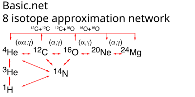

By default MESA adopts the `basic.net` approximate network. Let's investigate more closely what reactions and isotopes are involved in this network. 

Navigate to `$MESA_DIR/data/net_data/nets/.` and open `basic.net`, it should read

```plaintext
      ! the basic net is for "no frills" hydrogen and helium burning.
      ! assumes T is low enough so can ignore advanced burning and hot cno issues.

      add_isos(
         h1 
         he3 
         he4 
         c12 
         n14 
         o16 
         ne20 
         mg24
         )
         
      add_reactions(
     
         ! pp chains
         
         rpp_to_he3          ! p(p e+nu)h2(p g)he3
         rpep_to_he3         ! p(e-p nu)h2(p g)he3     
         r_he3_he3_to_h1_h1_he4       ! he3(he3 2p)he4 
         r34_pp2             ! he4(he3 g)be7(e- nu)li7(p a)he4 
         r34_pp3             ! he4(he3 g)be7(p g)b8(e+ nu)be8( a)he4  
         r_h1_he3_wk_he4               ! he3(p e+nu)he4     

         ! cno cycles
         
         rc12_to_n14         ! c12(p g)n13(e+nu)c13(p g)n14
         rn14_to_c12         ! n14(p g)o15(e+nu)n15(p a)c12
         rn14_to_o16         ! n14(p g)o15(e+nu)n15(p g)o16
         ro16_to_n14         ! o16(p g)f17(e+nu)o17(p a)n14

         ! helium burning
         
         r_he4_he4_he4_to_c12

         r_c12_ag_o16
         rc12ap_to_o16       ! c12(a p)n15(p g)o16    

         rn14ag_lite         ! n14 + 1.5 alpha = ne20

         r_o16_ag_ne20
         ro16ap_to_ne20      ! o16(a p)f19(p g)ne20    

         r_ne20_ag_mg24
         rne20ap_to_mg24     ! ne20(a p)na23(p g)mg24

         ! auxiliaries -- used only for computing rates of other reactions
         
         rbe7ec_li7_aux 
         rbe7pg_b8_aux 
         rn14pg_aux 
         rn15pg_aux 
         rn15pa_aux 
         ro16ap_aux 
         rf19pg_aux 
         rf19pa_aux 
         rne20ap_aux 
         rna23pg_aux 
         rna23pa_aux

         rc12ap_aux               ! c12(ap)n15                 
         rn15pg_aux               !        n15(pg)o16           
         ro16gp_aux               ! o16(gp)n15                
         rn15pa_aux               !        n15(pa)c12
           
         )     
```

Core-Hydrogen burning is characterized by two key processes:


The proton-proton chain: 
 
PP I, II, II, and pep chains are visualized here

<!--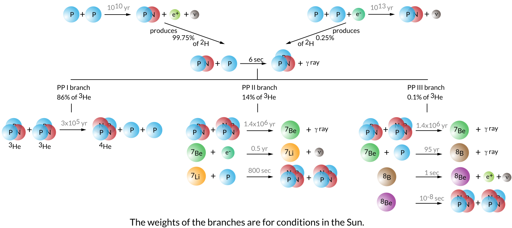-->

 
and the Carbon-Nitrogen-Oxygen (CNO) Cyles:
 
CNO I, II, III, and IV cycles visualized here

<!--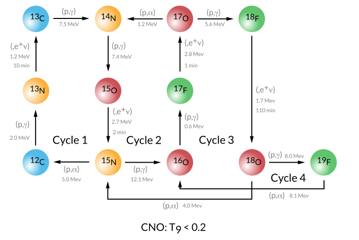-->


Because the temperature sensitivity of the CNO cycle nuclear reactions increase more steeply with temperature $\epsilon_{CNO} \propto T^{17}$, as opposed to $\epsilon_{pp} \propto T^{4}$, Hotter stellar models are dominated by CNO cycle nuclear reactions. 

|&#10067; Question|
|---|
|Where does our stellar model lie in the diagram below?|

<!--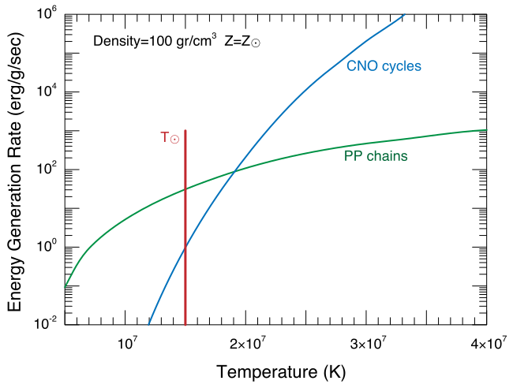-->


<details markdown="block">
<summary>Answers: Where does our model live in the diagram </summary>
Our model lives far to the right at high core temperatures $T \sim 30 $ MK, and is dominated by CNO cycle nuclear reactions.
</details>

At hotter temperatures, additional proton-capture pathways, the hot CNO cycles, begin to dominate. In the hot CNO regime (\(0.2 \lesssim T_9 \lesssim 0.5\)), beta-limited CNO cycling and breakout channels become more important, and at still higher temperatures (\(T_9 \gtrsim 0.5\)) the flow moves toward the rp-process.

For H-burning regions that reach high temperatures (for example hot AGB/SAGB envelopes), the Ne-Na cycle turns on and can strongly affect Na and Ne abundances. Related Ne/Mg/Na channels are also important in massive-star evolution during advanced burning (especially C, Ne, and O burning), where they influence both composition and neutrino losses (see [Farag et al. 2024](https://ui.adsabs.harvard.edu/abs/2024ApJS..273..28F/abstract)).

<!--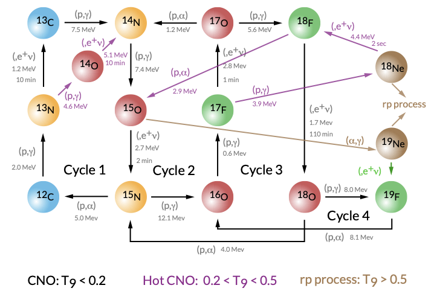-->
<!--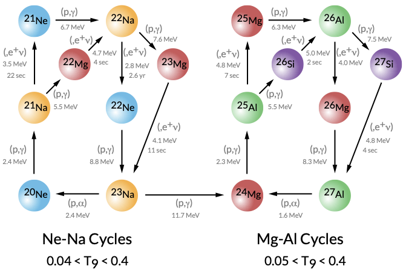-->


### Other Hardwired networks

The Basic.net network might not be capturing all the nucleosynthetic processes we are trying to study, 

|&#10067; Question|
|---|
|Which isotopes in the four CNO cycles visualized above are missing from our `basic.net`?|
|If we wanted to switch to a slightly more detailed network, how would we do it?|


Let's inspect some of the other network files available in MESA `$MESA_DIR/data/net_data/nets/`. Since we are only evolving our stellar model through core-Hydrogen burning, perhaps we should select a network that is more specific to this phase of evolution?  

Looking inside `pp_and_cno_extras.net`, we find that this network adopts `basic.net` as before but adds in additional isotopes and reactions to resolve pp and cno burning.

```plaintext
      include 'basic.net'
   
      include 'add_pp_extras'

      include 'add_cno_extras'
```

|:clipboard: TASK|
|:--|
|Look at 'add_pp_extras' and 'add_pp_extras'.|
|change the nuclear reaction network in `&star_job` to adopt `pp_and_cno_extras.net`! See [MESA &starjob documentation: changing networks](https://docs.mesastar.org/en/25.12.1/reference/star_job.html#change-initial-net).|
|Run the model again!|

Are there any notable changes in your model's properties or behavior? How does the run time of your MESA Calculation change?


<details markdown="block">
<summary>Answers: pp_and_cno_extras pgstar movie from pre-main sequence to core-H depletion </summary>

<video width="640" height="480" controls>
  <source src="Figures/movie_pp_cno.mp4" type="video/mp4">
  Your browser does not support the video tag.
</video>
</details>


### Generalized Networks
All the previous networks (hydrogen burners, α-chains) are examples of hardwired networks. Such networks are carefully crafted by hand and have the advantage of being fast and lightweight. The main disadvantage is that they are inflexable with respect to adding or removing isotopes. In this section we will explore general soft-wired networks, capable of doing any reaction network. General networks in MESA typically have titles such as 
    `mesa_28.net`, or `mesa_151.net`, or `mesa_206.net`
    
    
Below are the contents of `mesa_28.net`.
```plaintext

add_isos_and_reactions(
   neut
    h  1  2 ! hydrogen
   he  3  4 ! helium
   li7      ! lithium
   be7
   be  9 10 ! berylium
    b8      ! boron
    c 12 13 ! carbon
    n 13 15 ! nitrogen
    o 14 18 ! oxygen
    f 17 19 ! fluorine
   ne 18 22 ! neon
   )
```

|&#10067; Question|
|---|
|How do you adopt a general network?|


|:clipboard: Bonus TASK|
|:--|
|Try switching to a generalized network.|
|change the nuclear reaction network in `&starjob` to adopt `mesa_28.net`!See [MESA &star_job nuclear reaction network documentation](https://docs.mesastar.org/en/25.12.1/reference/star_job.html#change-initial-net).|
|Run the model again, and take note of the run time difference!|

When changing nuclear reaction networks `change_initial_net` only operates when loading from an initial model whereas `change_net` operates any time the inlist is read. This means that if you restart from a photo `./re x200`, your stellar model will not adjust the network if `change_initial_net = .true,`, rather the network will only be modified if `change_net = .true.`

|:information_source: Building your own network file|
|:--|
| If you make your own network, the .net file can but does not need to live inside `$MESA_DIR/nets/data/net_data`. You can choose to place the network file inside your local MESA model directory.|

When building a network file for your stellar evolution model, one should always consider specific processes you are trying to resolve, as larger networks are more time consuming and numerically challenging to solve. 

When MESA solves the stellar structure equations, each equation is discretized and solved by forming a jacobian matrix for each stellar model zone. The tridiagonal block matrix is then solved implicitly using as a multidimensional Newton Raphson solve.

The structure of MESA's jacobian matrix in a single zone is shown below for the case of the `basic.net` nuclear reaction network. Note that these three blocks of matrices are fully coupled and solved simultaniously in each zone of the stellar model. 
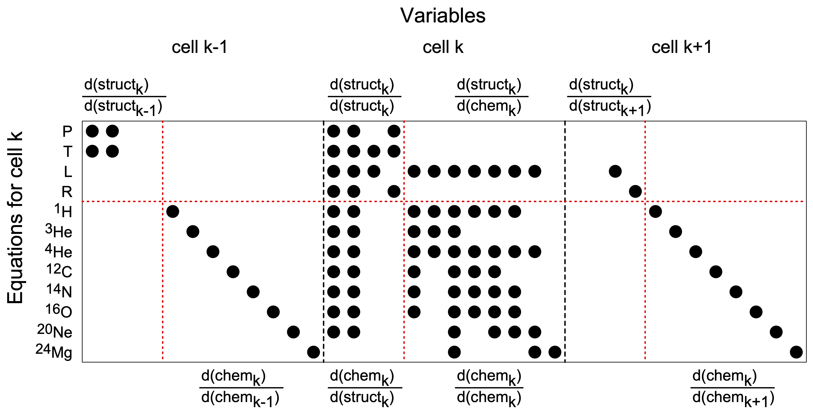

<!--<object data="Figures/mesa_jacobian_illustrated.pdf" type="application/pdf" width="100%" height="700">-->
<!--  <a href="Figures/mesa_jacobian_illustrated.pdf">Open `mesa_jacobian_illustrated.pdf`</a>-->
<!--</object>-->


Each additional isotope adds an additional equation that must be solved, and hence another row and column to the matrix in each stellar model zone. For $n_{iso}$ isotopes, the total jacobian size therefore scales with $n_{iso}^{2}$. 

The Jacobian matrix for a single zone 127 isotope network is visualized below. Notice how the sparsity in the matrix grows with an increasing number of isotopes. The increase in computational time associated with solving large nuclear reaction networks not only comes from the size of the jacobian matrix, but also the difficulty with which it is solved. All things being equal,a larger nuclear reaction network by nature of being more numerically stiff, tends to take extra newton iterations to solve inside MESA.  
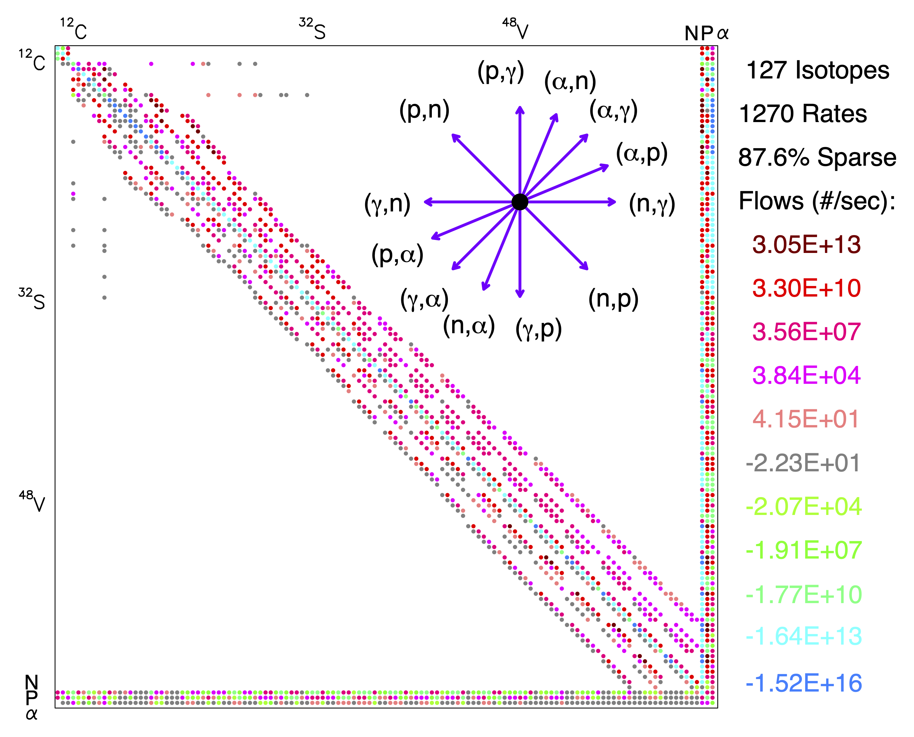

<!---->
<!--<object data="Figures/torch127_jac.pdf" type="application/pdf" width="100%" height="700">-->
<!--  <a href="Figures/torch127_jac.pdf">Open `torch127_jac.pdf`</a>-->
<!--</object>-->


### Network choice during advanced burning


For later phases of stellar evolution, such as silicon burning in a massive stellar core, the temperature sensitivity of specific nuclear reaction rates can also grow substantially. For example, during Silicon burning the temperature sensitivity for energy generation is orders of magnitude larger, $\epsilon\_{Si} \propto T^{47}$ [Timmes & Woosley 1992](https://ui.adsabs.harvard.edu/abs/1992ApJ...396..649T/abstract).

 The large temperature sensitivity and sparsity in the matrix can lead to larger condition numbers, hence a more numerically stiff nonlinear system. This can make accurate nucleosynthesis calculations of massive star evolution extremely challenging and prone to a variety of numerical pitfalls.

For this reason, MESA also contains approximate networks for late burning phases. Below we highlight `approx21.net`, which includes all the necessary alpha chain reactions up through $^{56}$ Fe. This network is the workhorse network that MESA more or less uses everywhere by default, and is an extension of `basic.net`. `approx21.net` and it's varient exist to allow one capture most of the nuclear processes that dominate energy generation rate in a stellar model, while forgoing many nucleosynthetic processes. 

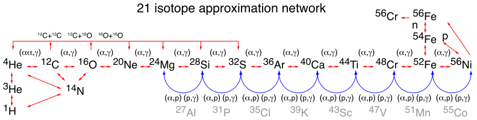


However, for accurately modeling advanced burning phases of stellar evolution, and properly capturing nucleosynthetic processes such as s-process, larger networks are needed. Likewise, the `approx21.net` does not contain many of the weak reactions necessary for capturing the $\beta$ processes, and electron captures. More extended generalized networks are need. 

An exploration of a variety of networks and their impact on massive star evolution and uncertainties was conducted in [Farmer et al. 2016](https://ui.adsabs.harvard.edu/abs/2016ApJS..227...22F/abstract). We show the networks they explored below.


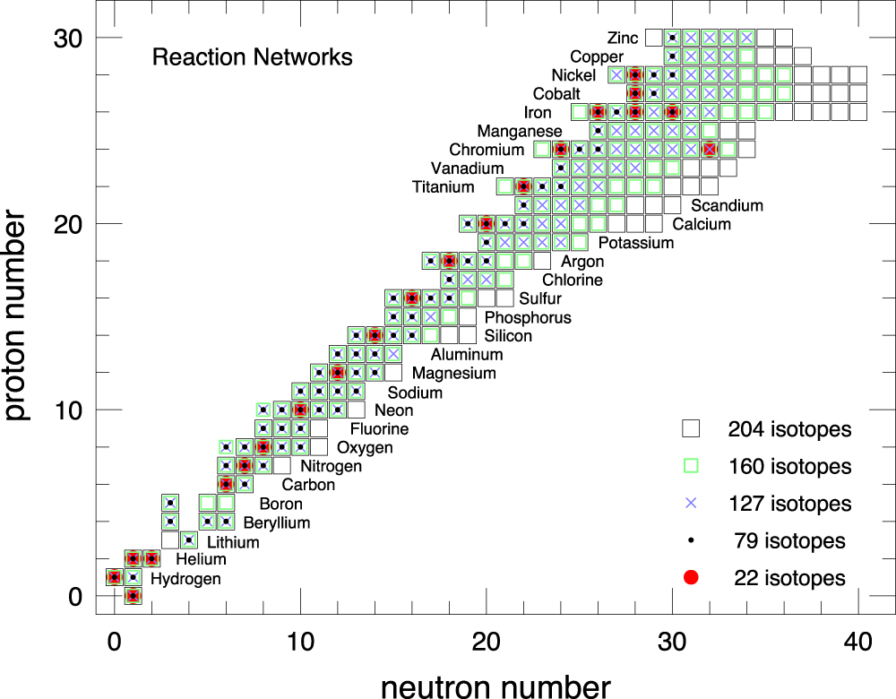


While 127 isotopes seems to be the benchmark for simulating massive stars evolving to core-collapse. For studying neutrino emission and capturing the energy generation rate correctly, even larger networks such as the 206 isotope network provide even more fidelity, and might even be necessary for finding convergence in model behavior. Similar to `mesa_204.net`, an illustration of the `mesa_206.net` network (my usual workhorse) is shown below.
<!--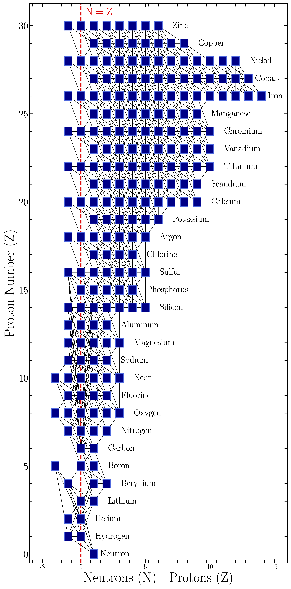-->


For resolving specific proccesses such as, for example the convective Urca cooling process, leading to electron capture supernova pregenitors, one might opt for a network which includes specific isotopes and nuclear reactions. A minimal network for resolving such a process is shown below, See  [Schawb et al. 2017](https://ui.adsabs.harvard.edu/abs/2017ApJ...851..105S/abstract), [Schawb 2021](https://arxiv.org/abs/2111.00132) for more details on the convective Urca Process.

```
      add_isos_and_reactions(
         h1,
         he4,
         c12,
         n14,
         o16,
         ne20,
         ne23,
         na23,
         na25,
         mg24,
         mg25,
         mg27,
         al27,
         fe56)


! Urca process reactions
add_reactions(
         r_na23_wk_ne23
         r_ne23_wk-minus_na23
         r_mg25_wk_na25
         r_na25_wk-minus_mg25
         r_al27_wk_mg27
         r_mg27_wk-minus_al27
)
```

### Some example process specific network choices (with some help from chatgpt)

If you want to design a process focused network for specific stellar evolution scenarios, here are some practical starting points.

- **Hot bottom burning (AGB/SAGB envelopes):** include CNO + NeNa + MgAl chains, e.g. `h1, he3, he4, c12, c13, n13, n14, n15, o15, o16, o17, o18, ne20, ne21, ne22, na23, mg24, mg25, mg26, al26, al27`.  
  Example ADS papers: [Ventura & D'Antona 2011](https://ui.adsabs.harvard.edu/abs/2011MNRAS.410.2760V/abstract), [Karakas & Lattanzio 2014](https://ui.adsabs.harvard.edu/abs/2014PASA...31...30K/abstract).

- **Massive star yields and rotation (Marco Limongi et al.):** include at least full H/He/C/Ne/O/Si burning plus Fe-group and weak channels, e.g. `h1, he4, c12, n14, o16, ne20, mg24, si28, s32, ar36, ca40, ti44, cr48, fe52, ni56`, and for heavy-element studies extend to a large generalized network.  
  Example ADS papers: [Limongi & Chieffi 2018](https://ui.adsabs.harvard.edu/abs/2018ApJS..237...13L/abstract), [Roberti, Limongi, & Chieffi 2024](https://ui.adsabs.harvard.edu/abs/2024ApJS..270...28R/abstract).

- **Metal poor abundance constraints (incl. Madeleine McKenzie co-authorship):** include isotopes that control CNO-F and light odd-Z yields, e.g. `c12, c13, n14, o16, o17, o18, f19, ne20, na23, mg24, mg25, mg26, al27`.  
  Example ADS links: [Mura-Guzman et al. 2025 (Fluorine abundances in CEMP stars)](https://ui.adsabs.harvard.edu/search/q=doi%3A10.1093%2Fmnras%2Fstaf464), [Madeleine McKenzie ADS author record](https://ui.adsabs.harvard.edu/search/q=author%3A%22McKenzie%2C%20Madeleine%22).

- **Thermohaline mixing on the RGB:** include light element tracers of extra mixing, e.g. `h1, he3, he4, li7, be7, c12, c13, n14, o16`.  
  Example ADS paper: [Charbonnel & Zahn 2007](https://ui.adsabs.harvard.edu/abs/2007A%26A...467L..15C/abstract).

- **Rotation induced mixing in massive stars:** include H/He burning plus alpha-chain species through Fe-group, e.g. `h1, he4, c12, n14, o16, ne20, mg24, si28, s32, ar36, ca40, fe56`.  
  Example ADS paper: [Heger, Langer, & Woosley 2000](https://ui.adsabs.harvard.edu/abs/2000ApJ...528..368H/abstract).

- **Convective boundary mixing and AGB dredge-up / s-process seeds:** minimally track `c12, c13, n14, o16, ne22, mg25, fe56`; for yields, add heavy species (Sr-Y-Zr and beyond).  
  Example ADS paper: [Herwig 2000](https://ui.adsabs.harvard.edu/abs/2000A%26A...360..952H/abstract).

- **Advanced burning shell mergers (late massive star evolution):** include extended alpha-chain + weak reactions with Fe-group coverage, e.g. up to `ni56` with neutron-rich neighbors.  
  Example ADS paper: [Laplace et al. 2025](https://ui.adsabs.harvard.edu/abs/2025A%26A...695A..71L/abstract).

- **Electron capture SN progenitors and Urca cooling:** include Urca pairs (`na23/ne23`, `mg25/na25`, `al27/mg27`) and ONeMg-core species (`o16, ne20, mg24`).  
  Example ADS papers: [Schwab et al. 2017](https://ui.adsabs.harvard.edu/abs/2017ApJ...851..105S/abstract), [Boccioli et al. 2024](https://ui.adsabs.harvard.edu/abs/2024PhRvD.110b3007B/abstract).

- **Type I X ray bursts (hot-CNO breakout + rp-process on accreting neutron stars):** no single network size is always required. For many burst studies, a moderate hot-CNO + breakout network can be sufficient (e.g. `h1, he4, c12, c13, n13, n14, n15, o14, o15, o16, o17, o18, f17, f18, f19, ne18, ne19, ne20, na21, na22, na23, mg22, mg23, mg24`). For detailed predictions of the final post-burst composition and the heaviest nuclei produced, use larger proton-rich networks (often hundreds of isotopes) up to \(A$\sim$100\) and include many weak interactions.  
  Example ADS papers: [Wallace & Woosley 1981](https://ui.adsabs.harvard.edu/abs/1981ApJS...45..389W/abstract), [Schatz et al. 2001](https://ui.adsabs.harvard.edu/abs/2001PhRvL..86.3471S/abstract), [Woosley et al. 2004](https://ui.adsabs.harvard.edu/abs/2004ApJS..151...75W/abstract).

- **Network convergence studies for core-collapse progenitors:** use multiple network sizes (e.g. approx21, 127-isotope, 204/206-isotope) to test structural and nucleosynthesis convergence.  
  Example ADS paper: [Farmer et al. 2016](https://ui.adsabs.harvard.edu/abs/2016ApJS..227...22F/abstract).

- **C/O core and white dwarf asteroseismology constraints:** include at least `c12, o16, ne22` and relevant weak/alpha channels that set final core composition profiles.  
  Example ADS papers: [Chidester et al. 2022](https://ui.adsabs.harvard.edu/abs/2022ApJ...935...21C/abstract), [Chidester et al. 2023](https://ui.adsabs.harvard.edu/abs/2023ApJ...954...51C/abstract).
