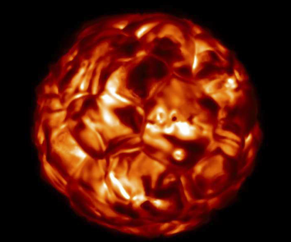
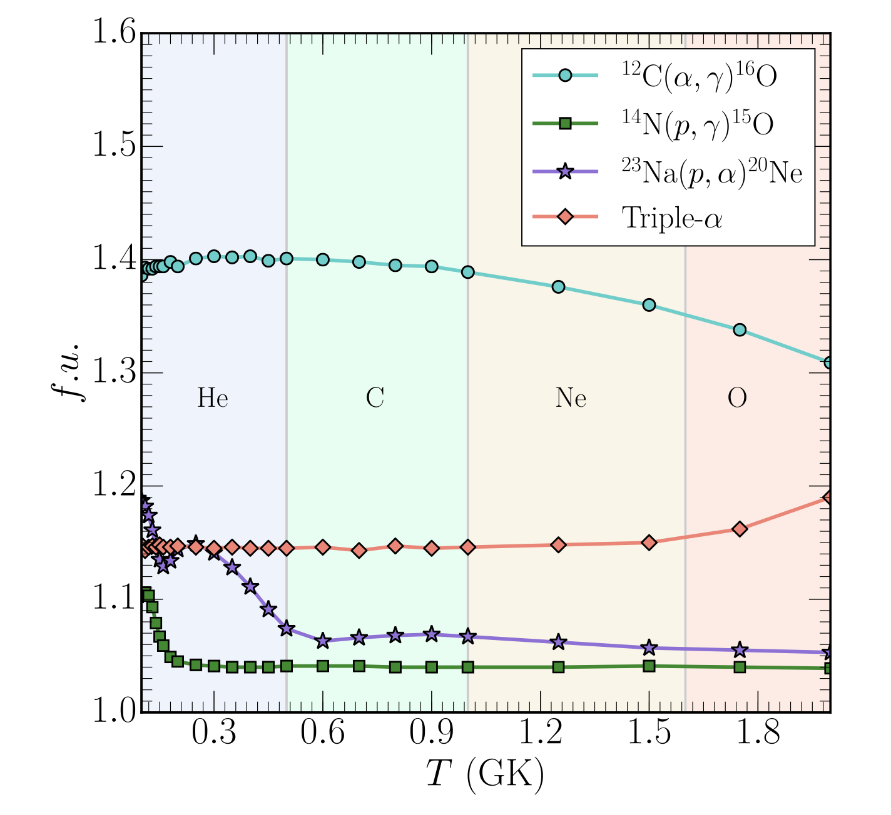
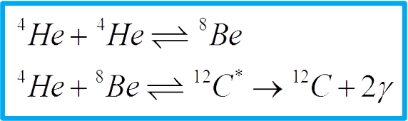
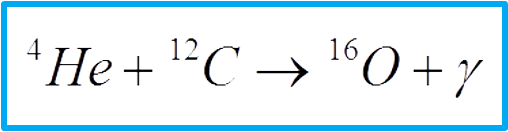
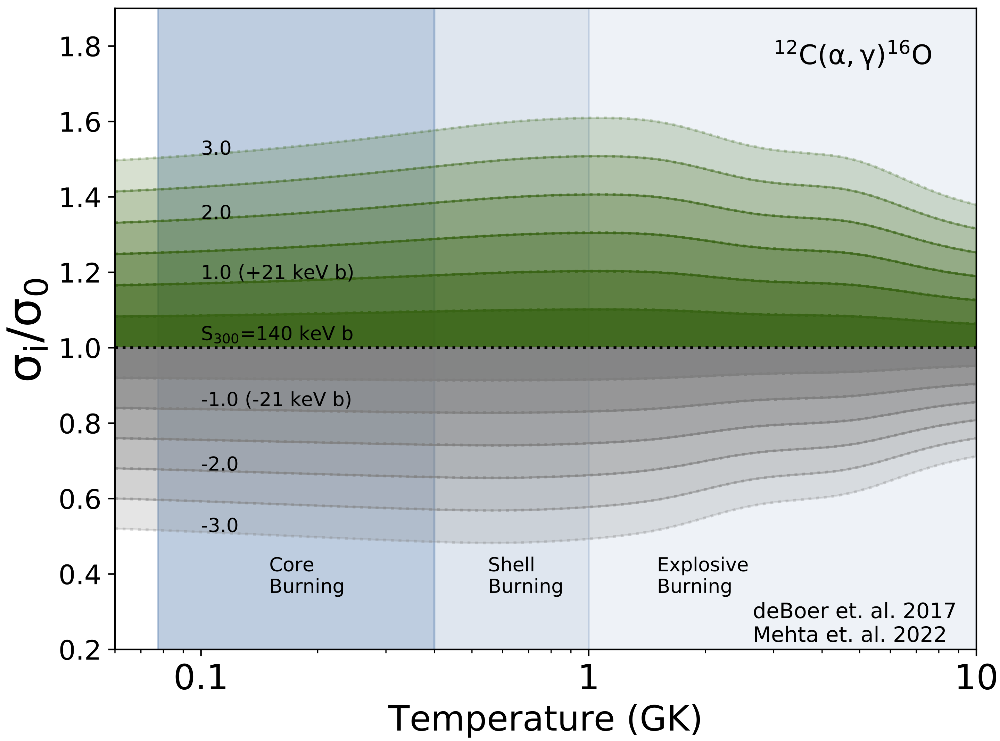
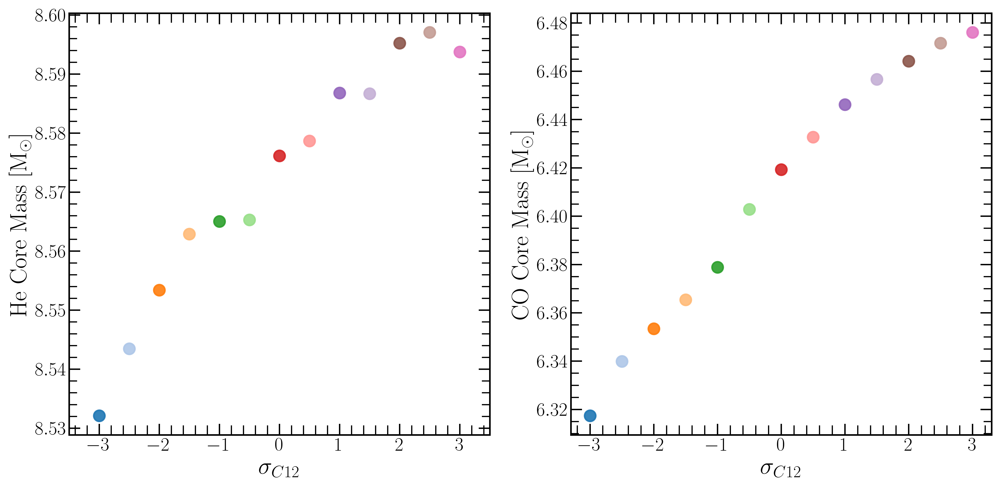
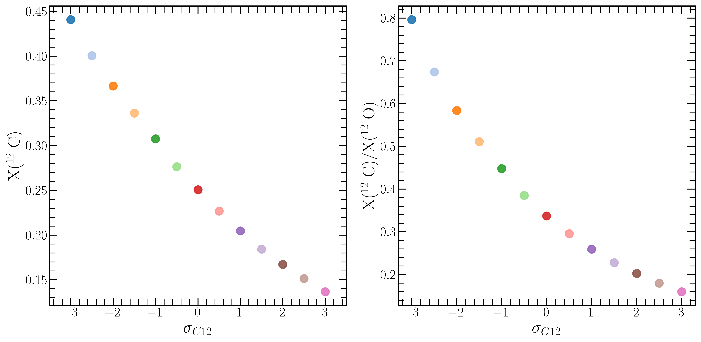
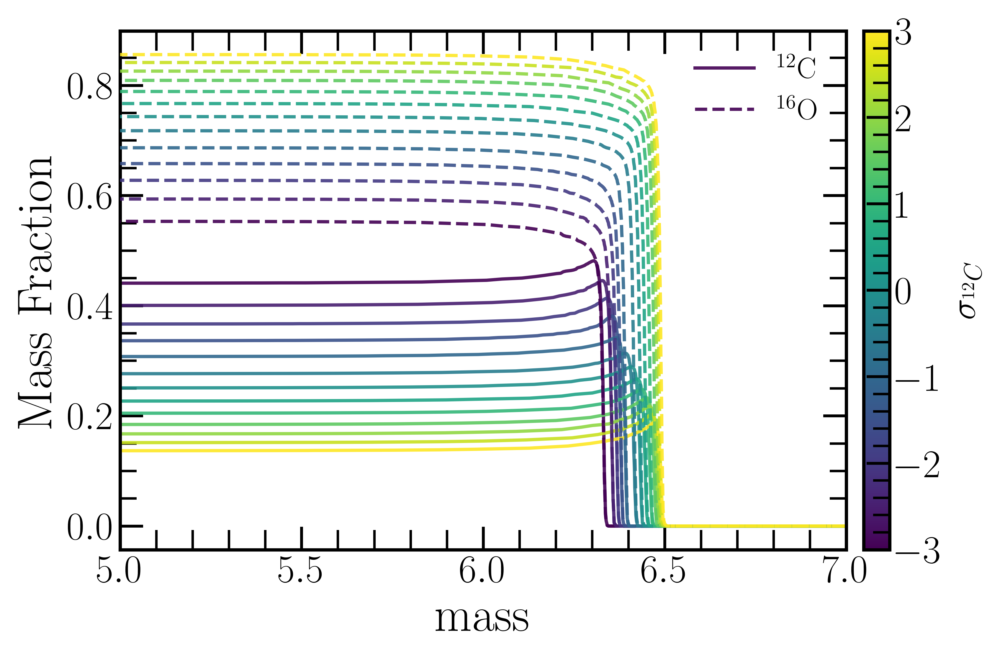
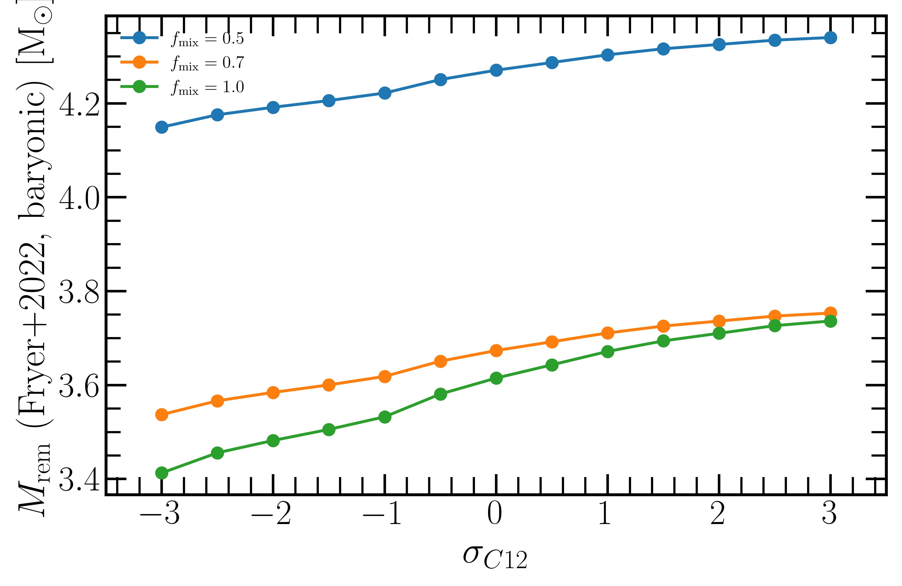

<script type="text/x-mathjax-config">MathJax.Hub.Config({tex2jax:{inlineMath:[['\$','\$'],['\\(','\\)']],processEscapes:true},CommonHTML: {matchFontHeight:false}});</script>
<script type="text/javascript" async src="https://cdnjs.cloudflare.com/ajax/libs/mathjax/2.7.1/MathJax.js?config=TeX-MML-AM_CHTML"></script>



credit: [Chiavassa et al. 2022](https://ui.adsabs.harvard.edu/abs/2022A%26A...661L...1C/abstract)

In this section, we will graduate from using our `Intro_MESA_model` model directory, and instead use the provided work directory.  [Changing_rates](https://drive.google.com/file/d/19_R2QITiDjMbPmCc-rnObhKKcITtbohT/view?usp=sharing) MESA work directory.


# 2. Changing Nuclear Reaction Rates

## Science goal

In this lab, we will focus on the evolution of a 20 M$\_{\odot}$ stellar model from the zero age main-sequence through to core-Helium depletion. We will explore which nuclear reaction rates MESA uses, how to change the rates MESA reads in, and finally we explore the impact of changing the $^{12}$C$(\alpha,\gamma)^{16}$O helium burning reaction rate, and its effect on the core properties of stellar model at core-Helium depletion. These properties are extremely important as the Carbon/Oxygen core mass, M$\_{CO}$, is often used in population synthesis calculations as an input into expressions for determining if the stellar model will form a neutron star to a black hole, and the corresponding remenant mass after the model undergoes core-collapse. See [Fryer et al. 2012](https://ui.adsabs.harvard.edu/abs/2012ApJ...749...91F/abstract), and [Fryer et al. 2022](https://ui.adsabs.harvard.edu/abs/2022ApJ...931...94F/abstract)
<!---->
<!--### Bonus goal-->
<!---->
<!--If you'd like to prepare for Lab3, you can start running a simulation with both stars and leave it running over lunch.-->


## Evolving to Core-Helium Depletion

To begin, please make sure to download a copy of the desired [changing_rates](https://drive.google.com/file/d/19_R2QITiDjMbPmCc-rnObhKKcITtbohT/view?usp=sharing) MESA work directory.
This work directory is a slightly modified version of the `\$MESA_DIR/star/test_suite/20M_pre_ms_to_cc` test_suite.

Once downloaded, you can decompress the file by
```shell-session
$ unzip changing_rates.zip
```

`tree ./changing_rates` should return the following.

```shell-session
├── clean
├── history_columns.list
├── profile_columns.list
├── inlist
├── inlist_common
├── inlist_mass_Z_wind_rotation
├── inlist_pgstar
├── inlist_project
├── make
│   └── makefile
├── mk
├── rate_tables
│   ├── c12ag_deboer_sigma_0p0_2000_Tgrid.dat
│   ...
├── re
├── re_nomodfiles
├── README.rst
├── rn_nomodfiles
├── run_lab
├── src
│   ├── run_star_extras.f90
│   └── run.f90
└── zams.mod

```

All relevent files are briefly described in the table below

### MESA STAR work directory

| Filename                | Description       |
|:------------------------|:------------------|
| `clean`                 | A bash file for cleaning the model directory.       |
| `inlist`                | The header inlist which points to all other inlists to determine which inlists are read and in what order. |
| `inlist_mass_Z_wind_rotation`                | The header inlist which points to all other inlists to determine which inlists are read and in what order. |
| `inlist_project`               | The main inlist which contains controls for the stellar evolution of the `m1`  |
| `inlist_common`               | The main inlist which contains controls for the stellar evolution of the `m2`     |
| `inlist_pgstar`         | The inlist which controls the pgstar output for each single star.      |
| `make/`                  | A directory containing the makefile.   |
| `mk`                    | A bash file for compiling MESA binary and Star in the model directory.      |
| `history_columns.list`  | A log file which determines which history values are saved in data files as a function of model timestep. |
| `profile_columns.list`  | A log file which determines which profiles values are saved in data files as a function of Mass/radius.     |
| `re`                    | A bash file for restarting the binary/star model executable from photos      |
| `run_lab`                    | A bash file for running the star model executable.      |
| `src/`                   | A directory containing the three files listed below.      |
| `run_star_extras.f90`   | A fortran file which can be modified to agument the stellar evolution routines.     |


`inlist_project`, `inlist_common`, and `inlist_mass_Z_wind_rotation` are the three main files that contain the microphysics information of our stellar evolution simulation.


## Helium Burning Nuclear Reactions

Nuclear Reaction rate uncertainties have a non-negliggable impact on stellar evolution models and their nucleosynthetic products.
See [Iliadis et al. 2011](https://ui.adsabs.harvard.edu/abs/2011ApJS..193...16I/abstract),[Laird](https://ui.adsabs.harvard.edu/abs/2023JPhG...50c3002L/abstract), [Fields et al. 2018](https://ui.adsabs.harvard.edu/abs/2018ApJS..234...19F/abstract),[Farmer et al. 2019](https://ui.adsabs.harvard.edu/abs/2019ApJ...887...53F/abstract) , [Farag et al. 2022](https://ui.adsabs.harvard.edu/abs/2022ApJ...937..112F/abstract), [Pignatari et al. 2023](https://ui.adsabs.harvard.edu/abs/2023EPJA...59..302P/abstract)

For massive star evolution, four of the most uncertain rates are illustrated below (Figure from [Fields et al. 2018](https://ui.adsabs.harvard.edu/abs/2018ApJS..234...19F/abstract))


Some of the most uncertain nuclear reaction rates in nuclear astrophysics are the rates that occur during Helium burning [Deboer et al. 2017](https://ui.adsabs.harvard.edu/abs/2017RvMP...89c5007D/abstract)



That is the triple-$\alpha$ nuclear reaction rates converting Helium into Carbon competes with the c12ag nuclear reaction rate
to set the final Carbon and Oxygen abundance in the stellar core at the end of Helium burning



The amount of Carbon and Oxygen in the stellar core is important as it fundamentally changes the nature of Carbon and Oxygen burning, and can have far reaching implications for the resulting presupernova stellar structure and the resulting neutron star, black hole initial mass function. 

The uncertainties in the $^{12}$C$(\alpha,\gamma)^{16}$O reaction rate are among the largest (visualized below)



## Changing the $^{12}$C$(\alpha,\gamma)^{16}$O rate

MESA's nuclear reaction rates are a combination of NACRE [Angulo et al. 1999](https://ui.adsabs.harvard.edu/abs/1999NuPhA.656....3A/abstract) and JINA REACLIB [Cyburt et al. 2010](https://ui.adsabs.harvard.edu/abs/2010ApJS..189..240C/abstract). Reaction rate screening corrections are from [Chugunov et al. 2007](https://ui.adsabs.harvard.edu/abs/2007PhRvD..76b5028C/abstract), a dynamic screening method which includes a physical parametrization for the intermediate screening regime and reduces to the weak [DeWitt et al. 1973](https://ui.adsabs.harvard.edu/abs/1973ApJ...181..439D/abstract), [Graboske et al. 1973](https://ui.adsabs.harvard.edu/abs/1973ApJ...181..457G/abstract) and strong [Alastuey and Jancovici 1978](https://ui.adsabs.harvard.edu/abs/1978ApJ...226.1034A/abstract), [Itoh et al. 1979](https://ui.adsabs.harvard.edu/abs/1979ApJ...234.1079I/abstract) screening limits at small and large values of the plasma coupling parameter. Weak reaction rates are based, in order of precedence, on [Langanke and Martinez-Pinedo 2000](https://ui.adsabs.harvard.edu/abs/2000NuPhA.673..481L/abstract), [Oda et al. 1994](https://ui.adsabs.harvard.edu/abs/1994ADNDT..56..231O/abstract), and [Fuller et al. 1985](https://ui.adsabs.harvard.edu/abs/1985ApJ...293....1F/abstract).

For hardcoded nuclear reaction rates, the definitions are set and called inside `$MESA_DIR/rates/private/raw_rates.f90`, with definitions for each rate contained inside `$MESA_DIR/rates/private/ratelib.f90`, or drawn from JINA Reaclib / weaklib.

We would like to change our stellar model to adopt one of the $^{12}$C$(\alpha,\gamma)^{16}$O reaction rates provided by `Deboer et al. 2017`. These high resolution nuclear reaction rates are available inside `./rate_tables` or `$MESA_DIR/data/rates_data/rates_tables` directories. By varying this rate, we can explore the temperature dependant uncertainty in this nuclear reaction. 

|:clipboard: TASK|
|:--|
|Pick a value of $\sigma$ for the $^{12}$C$(\alpha,\gamma)^{16}$O rate shown in the figure above. Use a different value than those sitting next you.|
|Change the $^{12}$C$(\alpha,\gamma)^{16}$O reaction rate to one of the Deboer et al. 2017 rates shown in the figure above.|
|Run your model to completion, and report your values in the google sheets document [here](https://docs.google.com/spreadsheets/d/13_nOw6fDVWArYquJWmh0mro1liEgC7_uCfqQcIMxsS0/edit?usp=sharing)|

|:information_source: HINT|
|:--|
|Look inside your local `changing_rates/rate_tables` directory, which was copied from $MESA_DIR/rates/rates_data/rate_tables.|
|To change the rate you are reading you'll have to modify the `rate_list.txt` file|

When your model has finished running, try to make a movie of your `&pgstar` diagram so you can watch the movie instead of re-running your MESA model. In your `Lab1_binary` directory you can execute the `images_to_movie` command to convert your saved `&pgstar` pngs into a movie. Here is an example that produces a .mp4 movie named `movie.mp4`.

```shell-session
$ images_to_movie "png/Grid1*.png" movie.mp4
```

<details markdown="block">
<summary>Answers: Changing the $^{12}$C$(\alpha,\gamma)^{16}$O reaction rate</summary>

uncomment the rate file you would like to read into MESA inside `change_rates/rate_tables/rate_list.txt`
```
! c12ag rates from debeor et al. 2017 improved with high resolution (mehta et al. 2022) 
! 0 sigma (median c12ag rate)
r_c12_ag_o16   'c12ag_deboer_sigma_0p0_2000_Tgrid.dat'

! positive sigmas (high c12ag)
!r_c12_ag_o16   'c12ag_deboer_sigma_0p5_2000_Tgrid.dat'
!r_c12_ag_o16   'c12ag_deboer_sigma_1p0_2000_Tgrid.dat'
!r_c12_ag_o16   'c12ag_deboer_sigma_1p5_2000_Tgrid.dat'
!r_c12_ag_o16   'c12ag_deboer_sigma_2p0_2000_Tgrid.dat'
!r_c12_ag_o16   'c12ag_deboer_sigma_2p5_2000_Tgrid.dat'
!r_c12_ag_o16   'c12ag_deboer_sigma_3p0_2000_Tgrid.dat'

! negative sigmas  (lo c12ag)
!r_c12_ag_o16   'c12ag_deboer_sigma_m0p5_2000_Tgrid.dat'
!r_c12_ag_o16   'c12ag_deboer_sigma_m1p0_2000_Tgrid.dat'
!r_c12_ag_o16   'c12ag_deboer_sigma_m1p5_2000_Tgrid.dat'
!r_c12_ag_o16   'c12ag_deboer_sigma_m2p0_2000_Tgrid.dat'
!r_c12_ag_o16   'c12ag_deboer_sigma_m2p5_2000_Tgrid.dat'
!r_c12_ag_o16   'c12ag_deboer_sigma_m3p0_2000_Tgrid.dat'
```

The results in the exell document should look something like this



Below are profiles of the same stellar model at core-Helium depletion, with differing $^{12}$C$(\alpha,\gamma)^{16}$O rates

</details>


## Connecting to Population synthesis models

Population-synthesis calculations usually do not evolve full stellar structure for every stellar model. Instead, they map pre-collapse core properties to compact-remnant masses using analytic prescriptions. Here we connect our MESA models to the smooth remnant-mass prescription in [Fryer et al. 2022](https://ui.adsabs.harvard.edu/abs/2022ApJ...931...94F/abstract), which is also used in population-synthesis studies such as [Olejak et al. 2022](https://ui.adsabs.harvard.edu/abs/2022MNRAS.516.2252O/abstract).

Definitions:

- $M_{\mathrm{CO}}$: CO-core mass at collapse (from your MESA model),
- $f_{\mathrm{mix}}$: mixing parameter in the Fryer+2022 fit,
- $M_{\mathrm{crit}}$: critical CO-core mass scale (use $M_{\mathrm{crit}} = 5.75\,M_\odot$),
- $M_{\mathrm{collapse}}$: total mass at collapse.

Using Fryer+2022, the baryonic remnant mass is

$
M_{\mathrm{rem}}^{(\mathrm{raw})} = 1.2 + 0.05\,f_{\mathrm{mix}} + 0.01\left(\frac{M_{\mathrm{CO}}}{f_{\mathrm{mix}}}\right)^2 + \exp\!\left[f_{\mathrm{mix}}(M_{\mathrm{CO}}-M_{\mathrm{crit}})\right]
$

and then

$
M_{\mathrm{rem}} = \min\!\left(M_{\mathrm{rem}}^{(\mathrm{raw})},\,M_{\mathrm{collapse}}\right)
$

This is the quantity we plot below. In this lab, changing the $^{12}$C$(\alpha,\gamma)^{16}$O rate shifts the final core structure (especially $M_{\mathrm{CO}}$), which then shifts $M_{\mathrm{rem}}$. That is the direct link from reaction-rate uncertainty to compact-remnant predictions used in population synthesis.

|:clipboard: TASK|
|:--|
|For each $\sigma_{C12}$ model, extract the final $M_{\mathrm{CO}}$ value from your MESA output.|
|Compute $M_{\mathrm{rem}}$ using the equations above for $f_{\mathrm{mix}}=0.5,\;0.7,\;1.0$.|
|If you have final total mass at collapse, apply the cap with $M_{\mathrm{collapse}}$; otherwise report the uncapped result.|
|Plot $M_{\mathrm{rem}}$ vs. $\sigma_{C12}$ and compare how the trend changes with $f_{\mathrm{mix}}$.|
|Briefly discuss what this implies for NS/BH outcomes in population-synthesis models.|


<details markdown="block">
<summary>Answers: $M_{\mathrm{rem}}$ for $^{12}$C$(\alpha,\gamma)^{16}$O reaction rate</summary>

</details>
